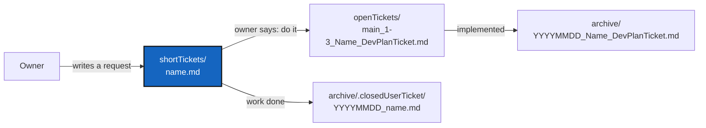

# DevTickets — where ComplexGitSync's tickets sit, and which branches they name

*Created: 2026-09-13*

*Fills in: ../../../.distant/ticket/TICKETLIFECYCLE.md*

## Abstract — read this first

**The one-line version.** The owner writes a short ticket in
`shortTickets/`; on the owner's word the agent makes every open ticket agree
with it; the short ticket is then stamped and filed under
`archive/.closedUserTicket/`. The loop and every naming rule are
[TICKETLIFECYCLE.md](../../../.distant/ticket/TICKETLIFECYCLE.md) (§6.1 for
the loop). This file says only what is ComplexGitSync's own.

**What this document is.** The fill-in of the ticket lifecycle: where
`DevTickets/` lives, which branches this project has and the filename prefix
each gives a ticket, and what does not belong here.

**Why it exists.** This whole tree used to sit in the public
`ComplexGitSync` repository as `AgentSpec/`, so anyone installing the tool
also got the workshop — sixty-odd internal plans, half of them about work
that was abandoned. The product is public; how the product is developed is
private. That is the same separation the tool itself draws between a project
repository and the private repositories that configure it. Branches and
their prefixes used to be written in `AdditionalSpecs.md`, but they are
process, not product, so they moved here.

**What you will find.** §1 where the tickets sit. §2 the branches and
their prefixes. §3 what does not belong here.

**Who it is for.** The owner, who writes short tickets, and the agent, who
turns them into plans. Nobody using `cgitsync` ever needs this directory —
that is why it is private.

**What you need to do with it.** Writing a request: put it in
`shortTickets/`. Acting on one, opening a plan or finishing one: follow
TICKETLIFECYCLE.md, using the branches in §2.

---

## 1. Where the tickets sit

`DevTickets/` is in the `.dev` mount (`.agent/.local/.dev/DevTickets/`),
private and writable, because a ticket is part of how the work gets done and
not a specification. The public repository holds no tickets at all.

| Directory | Holds | Written by |
|---|---|---|
| `shortTickets/` | Open requests, in the owner's own words. A few lines is a normal size. | The owner |
| `openTickets/` | Planning tickets: `<branch>_<priority>-<rank>_<Name>_DevPlanTicket.md` | The agent, on the owner's word |
| `archive/` | Planning tickets whose work has landed, or that were dropped: `YYYYMMDD_<Name>_DevPlanTicket.md`. Also a few one-off repair scripts kept beside the ticket they served. | The agent, in the commit that finishes the work |
| `archive/.closedUserTicket/` | Short tickets that have been acted on: `YYYYMMDD_<name>.md` | The agent, when the request is satisfied |
| `archive/.deepArchive/` | The immutable copy of each archived ticket, as it was the day it was archived | The agent, in the same change that archives it |

`DevTickets/` holds nothing else. A listing of the open tickets is the sorted
`openTickets/` directory; there is no separate summary to keep true.

This project adopted the deep archive on 2026-10-02 (owner): tickets
archived before then have no deep copy and are history tickets, so the link
repairs made on 2026-10-01 are allowed edits. Moving `DevTickets/` from
`.localSpec` to `.dev` on 2026-10-08 (`AgenticTwoLevels`) re-pointed the
links of history tickets, which TICKETLIFECYCLE §4.1 allows, and left the
deep copies and the closed short tickets byte for byte as they were; their
relative links that left `DevTickets/` therefore no longer resolve, which is
the cost of never editing them.

## 2. Branches and ticket topics

`main` is where ComplexGitSync's work lands, with three exceptions.

| Workstream | Branch | Ticket filename prefix |
|---|---|---|
| Everything else | `main` | `main_` |
| Memory — a change that **migrates a stored memory format**: the state area's layout, the ledger schema, or the distant reference ledger | `memory-dev` | `memory-dev_` |
| Data — the `DataManager` layer, the DVC backend, `data_backend`/`data_paths`, and data materialisation and publication | `data-repo` | `data-repo_` |
| Packaging awaiting the owner's review — UserInstallPath, held off `main` until the owner merges or drops it (owner, 2026-10-01) | `tmpPyPi` | `tmpPyPi_` |

Those four are the only ticket filename prefixes this project has. An open
memory ticket is named
`memory-dev_<priority>-<rank>_<Name>_DevPlanTicket.md` and carries
`*Branch: memory-dev*` under its `*Created:*` line; every other open ticket
is `main_<priority>-<rank>_<Name>_DevPlanTicket.md` and carries
`*Branch: main*`. The prefix is written out in both cases — `main_` is not
implied by its absence. Both conventions are defined in TICKETLIFECYCLE.md
§2.3 and §3; this section only says which branches exist here.

**A change that migrates a stored memory format is developed on
`memory-dev`.** The memory work was seven dependent milestones — see the
MemoryArchitecture ticket in [archive/](archive/) — that between them renamed
the state area, rewrote the ledger, moved code into a new `memory/` package
and added a network protocol. Interleaving those with releases on `main`
would put a half-migrated memory format in front of users, and the one thing
this project cannot afford to corrupt by accident is the record of what it
synchronised. `memory-dev` merges into `main` when a milestone is finished
and `pixi run lint` and `pixi run test` both pass.

**The test is migration, not subject matter.** Touching `.cgitsync/` or
`memory/` does not by itself send a ticket to `memory-dev`: work that only
*adds* — a new content-addressed directory beside the State, a ledger field
that is absent on older entries and so leaves every chain already written
verifying byte for byte — puts no half-migrated format in front of anyone,
and lands on `main`. That is the rule the 2026-09-18 review applied when it
moved MemoryArchitecture and StateLocking onto `main`, and the 2026-09-19
one when it opened
[TreeEnvironment](archive/20260920_TreeEnvironment_DevPlanTicket.md) there.

**Every change to the data layer is developed on `data-repo`.** The data
work is six dependent milestones — see the DataArchitecture ticket in
[openTickets/](openTickets/) — that between them add a `.cgs`/`.gts`
declaration, a `DataManager` dispatch layer, a DVC backend, and new refusals
in the authoring, materialisation and release paths. A half-built data layer
that stages a multi-gigabyte dataset into Git, or freezes a release whose
data cannot be fetched, is not something to ship by accident on `main`. The
branch merges back when a milestone is finished and `pixi run lint` and
`pixi run test` both pass. DVC itself stays an optional Pixi feature: a
Git-only project installs none of it.

The prefix replaced an earlier topic prefix (`memDev-`), which named the
same group one spelling differently. See
[the TicketBranchNaming ticket](archive/20260916_TicketBranchNaming_DevPlanTicket.md).

**The private configuration repositories keep their own branches.**
`.localSpec`, `.claude` and `.dev` sit on `ComplexGitSync`, and the shared
`DevSpec`, `.ticketing` and `DocSpec` on `main`. This rule does not change
them: a memory ticket edited in `.dev` is still committed on the
`ComplexGitSync` branch of `.dev`. The branch line names the branch of the
project's own repository.

## 3. What does not belong here

Specifications and living documents are not tickets (TICKETLIFECYCLE §7).
In this project:

| Belongs in | Not in `DevTickets/` |
|---|---|
| `.agent/.local/.localSpec/AdditionalSpecs.md` | Architecture, rings, formats |
| `.agent/.local/.localSpec/audit.md` | Findings, legacy references, open risks |
| `.agent/.local/.localSpec/AGENT.md` | The agent roles and how they hand off |
| `.agent/.distant/` | The project-agnostic rules |
| `docs/DevGuide/` | How the code is put together, for contributors |
| The public repository | Anything a user of `cgitsync` needs |
