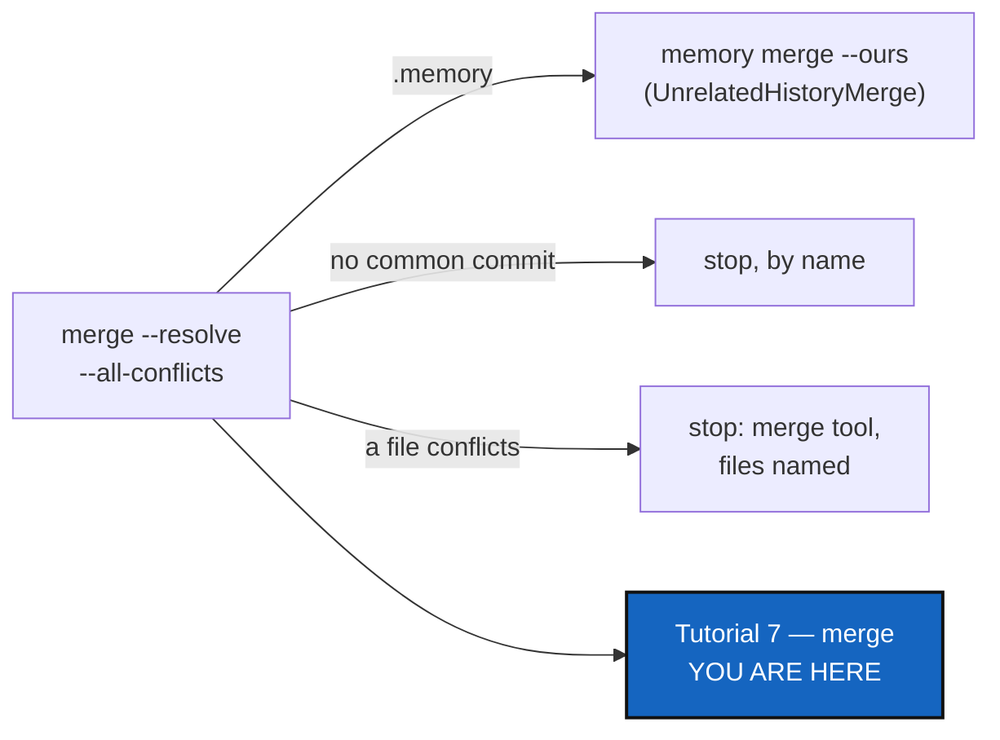

# MergeErgonomics — `--resolve` never Git-merges a memory, never loops, never resolves in silence; and a seventh tutorial on merge

*Created: 2026-10-08*

*Branch: main*

> **Update — 2026-10-08, after UnrelatedHistoryMerge landed.** Part of this
> ticket is already done, and the rest changes shape:
> - **F6 is done**: Tutorial 6 §3, §5.1 and Step 5 no longer describe a
>   file-by-file memory merge. WP5 here only adds the links to Tutorial 7.
> - **F1 is done in the code**: `merge_tree_one_at_a_time` now keeps the
>   memory (`MemoryMergeOperation.keep_in_tree`) and skips an up-to-date one,
>   because leaving it on `git merge` would have been a regression of the new
>   statuses. Still open under F1: a test that `--resolve` and
>   `--all-conflicts` never open a merge tool on `.memory`.
> - **F2 is not done**: an `unrelated` repository still stops `--resolve`
>   with no path, and `merge_resolve_all` still loops on it. WP1 here is now
>   that stop only; the helper is `MemoryMergeOperation.tree_status`
>   (`operations/memory_merge.py`), not a function in `merge.py`.
> - F3, F4, F5 and F7 are untouched.

> From the owner's short ticket
> [tuto7-merge](.closedUserTicket/20261008_tuto7-merge.md)
> (2026-10-08): merge is a very complex task on Git and more so on
> ComplexGitSync, especially for the memory, whose private/local status may
> disrupt `merge --all --resolve`. Reinforce the ergonomics of merge, make
> sure `merge --all --resolve` never forces a Git merge of the memory under
> `--private`, and write a seventh tutorial on merge alone, after Tutorial 6
> on memory, which explains `memory merge`.

| | |
|---|---|
| Predecessor | [UnrelatedHistoryMerge](20261008_UnrelatedHistoryMerge_DevPlanTicket.md) — it adds `memory merge` and the `unrelated` status, and routes `.memory` out of `merge`, `merge --into` and `pull --private`. This ticket does the same for the two `--resolve` paths it does not touch, and teaches the result |

## Abstract — read this first

**The one-line version.** `merge --resolve` and `--all-conflicts` handle
the memory the way a plain `merge` will (keep the target's, the source's as
history), stop by name on anything they cannot resolve, and never resolve a
file without saying so; Tutorial 7 teaches merging a tree end to end.

**What this document is.** What is wrong today (§1), premises (§2), what
changes (§3), the tutorial (§4), work packages (§5), decisions (§6),
acceptance (§7).

**Why it exists.** `--resolve` is the mode a user reaches for when a merge
is already hard, and today it is the least safe: it Git-merges the memory
like any repository, `--all-conflicts` can loop for ever on a repository
with no common history, and its automatic "regeneration" cannot run and
would silently pick sides if it did. Nothing tests it. And the only
tutorial that shows a memory being merged (Tutorial 6) teaches the
file-by-file merge UnrelatedHistoryMerge forbids.

**Who it is for.** The worker and orchestrator who implement it; the owner
for §6.

**What you need to do with it.** Implement after UnrelatedHistoryMerge.
Re-check §2 against `HEAD`, then §5 in order.

---

## 1. What is wrong today

| # | Defect | Severity |
|---|---|---|
| F1 | `merge --resolve` merges `.memory` with `git merge`, like any repository. Two memories always collide or interleave (a ledger is `<seq>.toml` files plus `HEAD`), so it stops in `.memory` with conflicts in ledger or State files, and `--all-conflicts` opens a merge tool on them — inviting a person to hand-edit a hash chain | High |
| F2 | `--all-conflicts` loops for ever on a repository whose branches share no commit: the conflict check names no file, `_handle_conflicted_files` treats "no file" as resolved, and the next pass stops at the same repository again | High |
| F3 | The automatic regeneration cannot run: it calls `python` and `latexmk` through the Git runner, which prefixes the Git executable (`git python …`) | Medium |
| F4 | Even if it ran, it would be wrong for a general tool: it hard-codes ComplexGitSync's own files (`scripts/ceiling_baseline.json`, `docs/*.pdf`), rewrites the ceiling baseline with `--write-baseline` (silently re-locking a ratchet that must only tighten), and marks binary conflicts resolved with `git add`, keeping one side without saying which | Medium |
| F5 | No test exercises `--all-conflicts` or `merge_resolve_all` | Medium |
| F6 | Tutorial 6 teaches that the memory "merges too" with `merge --private` (§3) and recommends merging memory-dev's memory into main's file by file (§5.1). After UnrelatedHistoryMerge both are false | Medium |
| F7 | No tutorial covers merging a tree: scopes, ordering, `--into`, the preview, all-or-nothing versus `--resolve`, the private derived branches, the memory, unrelated histories, closing the branch afterwards. Those are spread over Tutorial 5, Tutorial 6 and the user guide | Low |

## 2. Premises (checked at `25757a0`, 2026-10-08)

| # | Premise | Where |
|---|---|---|
| P1 | `--resolve` merges one repository at a time, project repositories first, and on `conflicts` runs `git merge` to leave markers for a merge tool | `operations/merge.py:458` (`merge_tree_one_at_a_time`), `:491` |
| P2 | `--all-conflicts` repeats `merge_resolve` until nothing stops it, deciding per stop whether to "regenerate" or open a merge tool | `orchestre/tree_commands.py:804` (`merge_resolve_all`) |
| P3 | A stop with no conflicting path is treated as resolved: `if not paths: return True # … no shared history, skip` — and nothing ends the loop | `orchestre/tree_commands.py:858`, `:864` |
| P4 | Regeneration hard-codes this project's files and calls `python`/`latexmk` via `git_runner._run` | `orchestre/tree_commands.py:868`, `:905`, `:918`, `:930` |
| P5 | `GitRunner._run` always runs the Git executable with the given arguments | `git_runner.py:1725-1730` |
| P6 | Binary conflicts are "marked resolved" with `git add` | `orchestre/tree_commands.py:901` |
| P7 | The help promises "Binary/generated files are regenerated automatically" | `cli/expert.py:429`, `:2041` |
| P8 | No test names `all_conflicts` or `merge_resolve_all` | `grep -rn "all_conflicts\|merge_resolve_all" tests` → empty |
| P9 | Six tutorials, each titled "Tutorial N of 6"; the README links each (`test_cli_smoke.py:1609`) and must stay under 250 lines (207 today); `tutorials/README.md` says "six" | `tutorials/0*.md:1`, `README.md:96-103`, `:162`, `tutorials/README.md:7` |
| P10 | Tutorial 6 §3 and §5.1 describe the memory merged file by file | `tutorials/06_memory.md:286-303`, `:450-466` |
| P11 | Only Tutorial 1 has a test that replays its steps in a sandbox | `tests/integration/test_tuto_cgsi1.py` |

## 3. What changes

1. **The memory in `--resolve` (F1).** `merge_tree_one_at_a_time` routes
   the memory mount through UnrelatedHistoryMerge's `memory merge --ours`
   helper, exactly as `merge` does: it is merged (kept, with the source as
   history) or skipped, and it is never a stop. `--all-conflicts` therefore
   never opens a merge tool on a memory.
2. **No loop (F2).** A repository with no common commit is the
   `unrelated` status from UnrelatedHistoryMerge, not `conflicts`: the run
   stops there by name and `--all-conflicts` ends. A stop with no path is
   never treated as resolved.
3. **No silent resolution (F3, F4, D1).** The hard-coded regeneration and
   the `git add` of binary files are removed. `--all-conflicts` continues
   past a repository only when Git resolved it; otherwise it stops, names
   every conflicting file, says which side each binary file would keep,
   and opens the configured merge tool for text files. A project that wants
   files rebuilt after a merge says so itself (§6 D1).
4. **The help says what happens (P7).** No promise of regeneration; one
   line per mode: all-or-nothing, one at a time, keep going.
5. **Tests (F5).** `--resolve` and `--all-conflicts` over a tree with a
   memory, an unrelated repository and a text conflict.

## 4. Tutorial 7 — merging a tree

`tutorials/07_merge.md`, "Tutorial 7 of 7", after Tutorial 6, for someone
who has a tree, private repositories (Tutorial 5) and a memory (Tutorial 6).
Built on one sandbox, like Tutorial 1.

| § | Content |
|---|---|
| 1 | What a tree merge is: one project branch, every repository, leaf first, project repositories before private ones; check out the target, or `--into` |
| 2 | Look before you merge: `--dry-run`, and how to read its plan |
| 3 | The three scopes: project only, `--private` (each private repository merges its derived branch `<default>_<branch>`), `--all`; read-only configuration repositories never move |
| 4 | When something conflicts: all-or-nothing by default, `--resolve` one at a time, `--all-conflicts` to keep going — and what each leaves behind if you stop |
| 5 | The memory: why it is never merged file by file, what `merge` does with it (keep the target's, the source's as history), and `memory merge b1 --into b2 --ours\|--theirs` when you want the other one |
| 6 | Two branches with no common commit: what the message means, and why `merge` will not force it |
| 7 | After the merge: `push`, `status` with `errors=0`, `branch close` and `branch delete`, and why a closed branch's memory is safe once merged |
| 8 | Summary table: situation → command |

**And around it:** Tutorials 1–6 become "of 7"; `tutorials/README.md`
lists seven; `README.md` gains one row in its use-case table and "the seven
tutorials" (still under 250 lines); Tutorial 6 §3 and §5.1, which
UnrelatedHistoryMerge corrects (F6), point to Tutorial 7 §5; Tutorial 6's mermaid graph
gains the arrow to 07.

## 5. Work packages

| WP | Files | Change |
|---|---|---|
| **WP0** | tests | Reproduce F1 and F2 first, as failing tests: `--resolve` on a tree whose memory diverged stops in `.memory`; `--all-conflicts` on a tree with an unrelated repository does not return (guarded by a timeout or an iteration cap in the test) |
| **WP1** | `operations/merge.py` | §3.1 and §3.2 in `merge_tree_one_at_a_time`, reusing UnrelatedHistoryMerge's helper — one decision, three call sites cannot disagree |
| **WP2** | `orchestre/tree_commands.py`, `cli/expert.py` | §3.2–§3.4: `merge_resolve_all` ends on any stop it cannot resolve; `_handle_conflicted_files` and `_regenerate_file` removed; help text |
| **WP3** | tests | WP0's tests pass; plus a text conflict that opens the merge tool (faked), a binary conflict that is named and not added, and `--all-conflicts` across two clean repositories and one conflict |
| **WP4** | `tutorials/07_merge.md`, `tests/integration/test_tuto_merge.py` | §4, and a test that replays the tutorial's commands in a local sandbox, as `test_tuto_cgsi1.py` does for Tutorial 1 |
| **WP5** | `tutorials/0[1-6]_*.md`, `tutorials/README.md`, `README.md`, `docs/Text/user_guide.tex` | "of 7", the index, one README row, Tutorial 6's links to Tutorial 7 (its §3 and §5.1 text is UnrelatedHistoryMerge's WP5), the user guide's `--resolve` paragraph aligned with §3 |

The eight checklist steps apply (`cgitsync-dev.md`). Behaviour changes in a
command: at least a `patch`.

## 6. Decisions for the owner

| # | Question | Recommendation |
|---|---|---|
| D1 | Remove automatic regeneration, or keep it declared per project? | **Remove it now.** It cannot run (F3) and is project-specific (F4). If wanted later, a project declares its own post-merge commands in its `.cgs`; that is a separate ticket |
| D2 | What does `--all-conflicts` do on a binary conflict? | **Stop and name it**, with the side Git would keep; never `git add` it for the user |
| D3 | Does Tutorial 7 replace the merge passages of Tutorials 5 and 6? | **No.** They keep one short paragraph each and link to Tutorial 7; the tutorial is the one place that teaches merge end to end |

## 7. Acceptance

1. No `--resolve` or `--all-conflicts` run ever Git-merges, stops in, or
   opens a merge tool on `.memory`.
2. `--all-conflicts` always terminates; an unrelated repository stops it by
   name.
3. No file is resolved, regenerated or `git add`-ed without the run naming
   it; the help promises nothing it does not do.
4. `tutorials/07_merge.md` exists, is replayed by its own test, and every
   tutorial, the index and the README agree there are seven.
5. Tutorial 6 no longer describes a file-by-file memory merge, and links to
   Tutorial 7.
6. `pixi run lint`, `pixi run test`, `check-ceilings`, `check-oo`,
   `check-spectree`, and `cgitsync status` with `errors=0`.
