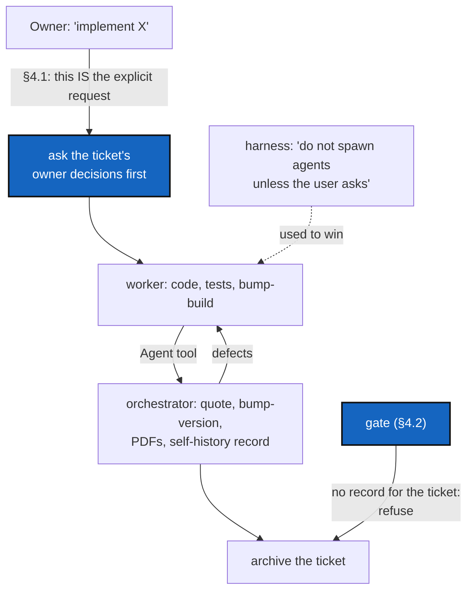

# PairRuleGate — "implement a ticket" launches the orchestrator, asks the owner first, and cannot be archived without the record

*Created: 2026-10-09*

*Branch: main*

> **Implemented — 2026-10-09 (`cgitsync5.2.1`), by a worker and a launched
> orchestrator, its decisions asked first.** The owner answered D1 both,
> D2 2026-10-09, D3 delete, D4 no. The orchestrator quoted 92, then 95,
> then 97/100 after the review fixes, which got their own build and patch;
> three records name this ticket. The import-ceiling raise the owner
> approved was not needed, since the ratchet counts lines and public
> symbols only. **Left to the owner:** CLAUDE.md's old descriptive paragraph
> after the eight steps, which §4.1 replaces, was not edited, because the
> session's permission classifier refused that edit; and WP4's upstream
> request for `DevSpec` is delivered in the closing report, to be filed there.

> From the owner's short ticket
> [pair-rule-gate](../archive/.closedUserTicket/20261009_pair-rule-gate.md),
> 2026-10-09, after MergeErgonomics was implemented by one
> agent alone: *"again you didn't follow the specs and didn't launch the
> orchestrator. What is not clear in the specs? As you do it always when I
> restart a session I think spectree and manifest are not read properly and
> needs a DevTicket."* Asked which fixes to plan, the owner chose two: an
> **imperative pair rule** and a **mechanical gate**. A project `.claude/`
> wired into the harness and a session-start hook were offered and not
> chosen.

## Abstract — read this first

**The one-line version.** The pair rule is written, cited in the digest and
read every session, and still broken every session, because it is phrased as
a description that loses to the harness's own order *not* to spawn agents,
and because nothing refuses the result. Rewrite it as an order with its
trigger and its tool, and make archiving a planning ticket fail without an
orchestrator's record.

**What this document is.** What happened (§1), why the specs did not bind
(§2), premises (§3), what changes (§4), work packages (§5), decisions (§6),
acceptance (§7).

**Why it exists.** AgentGuardrails (archived 2026-09-30) proved that a rule
nobody reads cannot bind, and put the rules in the digest. This ticket is the
next lesson: a rule that *is* read still does not bind when another
instruction, closer and phrased as an order, says the opposite, and when
breaking it costs nothing at the moment of output.

**Who it is for.** The worker and orchestrator who implement it; the owner
for §6.

**What you need to do with it.** Read §2, then decide §6, then implement §5
— with an orchestrator, launched as §4.1 says, so that this ticket is the
first one implemented under its own rule.

---

## 1. What happened

The MergeErgonomics session (2026-10-09, worker Anthropic `claude-sonnet-5-5`)
loaded `CLAUDE.md` and `digest.md` in full, then:

| # | Rule broken | Where it is written |
|---|---|---|
| E1 | Implemented the ticket alone; no orchestrator was launched until the owner objected | `digest.md` §Implementing a ticket, line 1; `CLAUDE.md` §Before committing; `cgitsync-dev.md` §The pair rule; `AgentConduct.md` §4 |
| E2 | Took the ticket's §6 *Decisions for the owner* as made, implemented the recommendations, and asked nothing | the ticket's own abstract ("the owner for §6"); no rule states it in general |
| E3 | Ran `pixi run bump-version patch` itself | `cgitsync-dev.md` §The pair rule ("…and runs step 4"); `AgentConduct.md` §4 table |
| E4 | Archived the ticket and reported it finished with a failing ratchet and owner questions unasked | `cgitsync-dev.md` step 1; `AgentConduct.md` §1 |

The orchestrator, once launched, quoted the work at 81/100 and found six
defects the worker had reported as done, the main one a run that never
reported a merge commit it made itself. That is the rule working; it only
worked because the owner forced it. The owner reports the same failure "always
when I restart a session".

## 2. Why the specs did not bind

The specs are not unclear. Read in isolation, every one says the right thing.
Four things defeat them.

**R1 — the harness gives the opposite order, and gives it as an order.** The
Claude Code system prompt describes its Agent tool with: *"Do not spawn agents
unless the user asks. … Only use this tool when the user explicitly says to
use a subagent."* The project says *"Implementing a ticket takes a worker and
an independent orchestrator"* — a description of what implementing involves,
not an instruction to do something now with a named tool. `CLAUDE.md` does
say project instructions override defaults, but a description does not
visibly contradict an order, so the model never sees a conflict to resolve:
it reads "takes two agents" as background and "only when the user explicitly
says" as the operative rule. The owner saying "implement X" is never
recognised as the explicit request the harness asks for, because nothing says
it is.

**R2 — the rule has no trigger and no sequence.** The digest line states the
rule; it does not say *when* (at the start, before the first edit), *how*
(the Agent tool, foreground, with the ticket, the diff and the checks), or
*what the worker must not do* (`bump-version`, the record, the score). The
first actionable moment the worker meets is "write the code", and nothing
interrupts it there.

**R3 — "Decisions for the owner" have no general rule.** Every planning
ticket ends with a §Decisions table carrying a recommendation. Nothing says
the recommendation is not the answer. A worker under a "When you have enough
information to act, act" default takes it.

**R4 — breaking the rule costs nothing at the moment of output.** Nothing
checks for an orchestrator. The self-history record is optional at every
step; a ticket can be archived, a commit message delivered, and a session
closed with none. `RuleConformity` (archived 2026-10-02) already listed the
pair rule as **not checked** because it needs the private record. Compare
the commit-message rule: it was broken until `cgitsync commit` started to
refuse (AgentGuardrails), and has not been broken since.

**On the owner's reading — SpecTree and the manifest.** It is true that a
session loads only `CLAUDE.md` and `digest.md`, and that `SpecTree.md`,
`AgenticManifest.md` and `AgentConduct.md` are a hop away. But that was not
the cause here: the pair rule is in the digest, and the digest was read.
Loading more files in full would add text, not force. R1–R4 are the cause;
§4 fixes them, and §6 D4 asks whether the load list should grow anyway.

## 3. Premises (checked at `f664cca`, 2026-10-09)

| # | Premise | Where |
|---|---|---|
| P1 | `CLAUDE.md` mentions the pair rule once, as a description, after the eight steps | `.agent/.local/.claude/CLAUDE.md` §Before committing, last paragraph |
| P2 | The digest states the rule in one line with no trigger, tool or sequence | `.agent/.local/.localSpec/digest.md` §Implementing a ticket |
| P3 | `AgentConduct.md` §4 says the rule and its scope; it is in the read-only `dev-sync` mount | `.agent/.distant/dev-sync/AgentConduct.md` §4 |
| P4 | A self-history record names `ticket`, `[worker]` and `[orchestrator]` (role, vendor, model) and `recorded_at`; pending records sit in `.cgitsync/.self-history/` (gitignored), folded ones in `.cgitsync/.memory/.self-history` | `src/ComplexGitSync/memory/self_history.py` (`SelfHistoryRecord`, `dirs`, `read_all`) |
| P5 | `check-spectree` runs `scripts/spec_tree.py --check --check-digest`; nothing reads `DevTickets/archive/` or self-history | `pixi.toml`, `scripts/spec_tree.py` |
| P6 | `cgitsync commit` already refuses a message that breaks the commit rule, in a tree that adopted DevSpec | `src/ComplexGitSync/commit_message.py` |
| P7 | No project `.claude/` directory exists at the root; `.agent/.local/.claude/settings.json` is not read by the harness and holds stale `/home/flipoyo/` paths | `ls -la` at the root |

## 4. What changes

### 4.1 The pair rule as an order (owner's choice 1)

Replace the descriptive paragraph in `CLAUDE.md` with a block titled
**"When the owner says 'implement <ticket>'"**, placed *before* the eight
steps, written as numbered orders:

1. **This is the explicit request for a subagent** that the harness's Agent
   tool asks for. Launching the orchestrator is not optional and needs no
   further permission.
2. Read the ticket. If it has a *Decisions for the owner* section, ask every
   open decision with `AskUserQuestion` **before the first edit**. A
   recommendation is not an answer.
3. Implement as the worker: code, tests, docs, `bump-build`. **Never** run
   `bump-version`, write a self-history record, or score your own work.
4. Launch the orchestrator with the Agent tool, in the foreground. Give it
   the ticket's name, where the diff is, and the owner's answers, and tell it
   to quote against the checklist, decide the version level, run
   `bump-version` and rebuild the PDFs, and write the record.
5. Fix every defect it reports, then send the work back to the same
   orchestrator for a re-quote. Repeat until it has no blocking defect.
6. Only then archive the ticket and deliver the commit message.

The same block, compressed, replaces the digest's pair-rule line (several
lines, each citing `CLAUDE.md` §When the owner says…), and
`cgitsync-dev.md` §The pair rule points to it rather than restating it. A new
digest line: *"A ticket's Decisions for the owner are asked before the first
edit; a recommendation is never taken as the answer."*

`AgentConduct.md` §4 is in the read-only `dev-sync` mount. WP4 drafts the
upstream change (a project stating the rule must state its trigger as the
explicit request for subagents, and the forbidden worker steps) as a short
ticket for `flipoyo/DevSpec`. Nothing in `.agent/.distant/` is edited here.

### 4.2 The gate (owner's choice 2)

A planning ticket cannot be archived without an orchestrator's record.

- **The check.** For every `DevTickets/archive/YYYYMMDD_<Name>_DevPlanTicket.md`
  stamped on or after the cut-off (§6 D2), at least one self-history record
  (pending or folded, `SelfHistoryRecord.read_all`) must name `ticket = "<Name>"`,
  carry an `[orchestrator]` whose role is `Orchestration`, and differ from its
  `[worker]` in role. Missing, it fails, naming the ticket.
- **Where it runs** (§6 D1): `pixi run check-tickets` (a new
  `scripts/ticket_gate.py`, beside `spec_tree.py`) for the agent and the
  owner, and `cgitsync commit` refusing a commit in the `.dev` repository
  that adds an archived planning ticket without its record — the moment of
  output, as for the commit message. CI cannot run it: the records are
  private and pending ones are on one machine only.
- **What it cannot prove.** That the orchestrator really was a separate
  agent: one agent can write a record with two roles. `AgentConduct.md` §4
  already says not to claim more independence than there is. The gate turns
  "forgot" into "refused"; it does not stop someone determined to lie, and
  the ticket must not claim it does.

## 5. Work packages

| WP | Files | Change |
|---|---|---|
| **WP0** | `tests/unit/test_ticket_gate.py` | Failing first: an archived ticket with no record fails; with a record whose orchestrator is the worker's role, fails; with a proper record, passes; a ticket archived before the cut-off is exempt |
| **WP1** | `.agent/.local/.claude/CLAUDE.md`, `.agent/.local/.localSpec/digest.md`, `.agent/.local/.dev/cgitsync-dev.md` | §4.1: the ordered block, the digest lines, the pointer; `check-spectree` still passes (every new citation resolves) |
| **WP2** | `scripts/ticket_gate.py`, `pixi.toml` | §4.2, the check and `pixi run check-tickets` |
| **WP3** | `src/ComplexGitSync/commit_message.py` (or its caller), `docs/Text/user_guide.tex` | §4.2, the refusal in `cgitsync commit` if D1 keeps it; documented beside the commit-message refusal |
| **WP4** | `shortTickets/` of `flipoyo/DevSpec` (drafted here, filed by the owner) | The upstream change to `AgentConduct.md` §4 |
| **WP5** | `.agent/.local/.claude/settings.json` | Only if D3 says so: delete the stale file, or move a cleaned copy to where the harness reads it |

The eight checklist steps apply. WP3 changes what a command does: at least a
`patch`. WP1 and WP2 alone change a script and a pixi task: `patch`
(Versioning.md, the change outside `src/` that changes what a script does).

## 6. Decisions for the owner

Ask these before the first edit (§4.1, step 2).

| # | Question | Recommendation |
|---|---|---|
| D1 | Where does the gate run: `check-tickets` only, or also as a refusal in `cgitsync commit` on the `.dev` repository? | **Both.** The task alone is one more thing to forget to run; the commit refusal is what made the commit-message rule hold |
| D2 | From which date are archived tickets checked? | **2026-10-09**, this ticket's own date. MergeErgonomics (20261009) has its record and passes; older tickets are exempt rather than back-filled with records nobody wrote at the time |
| D3 | What becomes of `.agent/.local/.claude/settings.json` (stale, unread)? | **Delete it** in this change; a harness configuration, if wanted, is a separate ticket (the options not chosen on 2026-10-09) |
| D4 | Should `CLAUDE.md`'s "load now" list grow beyond `digest.md` (SpecTree, the manifest, AgentConduct)? | **No.** The failure was not unread text (§2). Keep the load short; put the ordered block in `CLAUDE.md` itself, which is always loaded |

## 7. Acceptance

1. `CLAUDE.md` states, before the eight steps, that "implement <ticket>" is
   the explicit request to launch an orchestrator with the Agent tool, lists
   the worker's forbidden steps, and says decisions for the owner are asked
   before the first edit; the digest carries the same lines with resolving
   citations.
2. `pixi run check-tickets` fails, naming the ticket, on an archived
   planning ticket stamped on or after the cut-off with no orchestrator
   record, and passes on today's archive.
3. If D1 keeps it, `cgitsync commit` in `.dev` refuses the commit that adds
   such a ticket, naming the rule, and the user guide says so.
4. This ticket is itself implemented by a worker and a launched orchestrator,
   its decisions asked first, and archived with its record — and the gate
   passes on it.
5. `pixi run lint`, `pixi run test`, `check-ceilings`, `check-oo`,
   `check-spectree`, and `cgitsync status` with `errors=0`.
