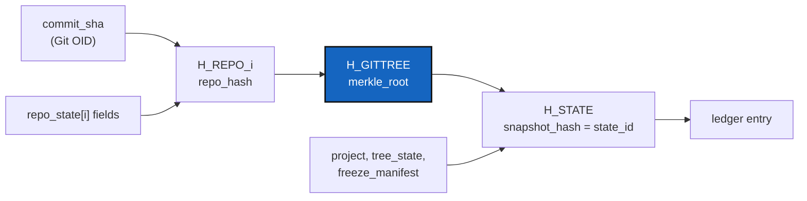

# GtsHashRepoPrecision — a State hash that says which repository diverged

*Created: 2026-10-08*

*Branch: memory-dev*

> **Implemented — 2026-10-08, archived on the owner's word.** D1–D8 landed
> in `cgitsync5.0.0` (MAJOR: an older reader cannot load a schema-1 `.gts`),
> then a review-fix commit (`memory reboot` reads a pre-schema State; the
> newer-schema refusal can no longer be masked) and `cfa572d`: every new
> State also writes `hash_canonicalisation = 4`, so a build before 5.0.0,
> after `checkout main` swapped to it, refuses the State by name instead of
> calling it corrupt — the owner hit exactly that on 2026-10-08. The owner ran
> the genesis (`memory reboot` on `memory-dev`) and merged `memory-dev` into
> `main`. Not done here: §7's CaWaQS check on two machines, the
> self-history record, and a version bump after `cfa572d` (that commit
> carries no `bump-build`). The merge of a rebooted memory that genesis
> exposed is
> [UnrelatedHistoryMerge](20261008_UnrelatedHistoryMerge_DevPlanTicket.md).

> Opened from the owner's short ticket `gtsHashRepoPrecision.md` (closed
> 2026-10-08 as `archive/.closedUserTicket/20261008_gtsHashRepoPrecision.md`).
> The specification in §3 and the decisions in §2 are the owner's, carried
> over unchanged. What this plan adds: the premises re-checked at
> `6f74a75` (§1), the gaps that check found (§1.1), the branch and rank, and
> the spec and ticket updates the change owes (D8, §6).

> **Status — 2026-10-08.** D1–D8 are implemented on `memory-dev`, in
> `cgitsync5.0.0` (MAJOR: an older reader cannot load a schema-1 `.gts`).
> An independent orchestrator quoted it at 77/100 and found three defects,
> fixed in a follow-up commit: `memory reboot` could not read the pre-schema
> State it is the remedy for; the newer-schema refusal could be masked by
> another field error; a backslash `relative_path` and a half-written failed
> stamp. Still open: §5 genesis on the developer memory (it pushes, so it
> waits for the owner), §7 CaWaQS, the CI job's first run, and the merge to
> `main`. Deviations: `gts_integrity.py` holds the hash functions as methods
> of one `GtsIntegrity` class (the class-first rule); G4 needed no change
> (registry-written snapshots carry no `schema_version`); line baselines
> raised for `memory_facts.py`, `memory/integrity.py` and
> `document_loader.py`, awaiting the owner.

| | |
|---|---|
| Scope | `.gts` State identity: repository leaf hash → GitTree Merkle root → State hash |
| Migration policy | Pre-release breaking change. No compatibility path. `memory reboot` opens the new genesis. |
| Successor | The owner's short ticket `robustness.md` names this ticket as its predecessor: it consumes `integrity_schema = 1` and must find it at §8's Definition of Done |

## Abstract — read this first

**The one-line version.** Replace the one flat State hash with three
nested ones — one per repository, a Merkle root over the tree, and the
State hash on top — so `verify` can name the repository that diverged.

**What this document is.** Why (§0), premises and gaps (§1), settled
decisions (§2), the frozen specification (§3), eight one-commit steps
(§4), genesis (§5), cross-ticket consequences (§6), real-tree validation
(§7), non-goals (§8), Definition of Done (§9).

**Why it exists.** Today a mismatch says only *"this State is wrong"*.
CGS has no released State contract yet, so this is the last moment the
hash can change shape without a migration story.

**Who it is for.** The worker and the independent orchestrator who
implement it (pair rule, `cgitsync-dev.md`); the owner for §5's genesis.

**What you need to do with it.** Re-run §1 against `HEAD`, then §4 in
order, one commit per step, on `memory-dev`.



---

## 0. Why

`GtsDocument.compute_snapshot_hash()` hashes one flat canonical JSON
payload (`gts_document.py:335-367`, canonicalisation 3). It answers *"is
this the same State?"* and nothing else: when it says no,
`memory_facts.py:103-118` reports one `STATE_DIGEST_MISMATCH` for the whole
snapshot. Which repository diverged is not something the hash can say.

The ticket replaces the flat hash with a three-level one and **deletes**
canonicalisations 1, 2 and 3 rather than carrying them.

What a State attests to does **not** change: the leaf payload is exactly
today's per-repository canonical dict. Only the structure of the hash
changes.

**Why `memory-dev`.** This changes what every stored State is named by,
with no reader for the old names (DevTickets/README.md §2: a change that
migrates a stored memory format). Between D1 and D4 the tree can read
neither the old nor the new format cleanly, which must never reach `main`.
The branch merges into `main` once §9 holds and `pixi run lint` and
`pixi run test` both pass.

**Why priority 1.** The owner asked for it, a feature freeze is in effect,
and the Robustness request is blocked on it.

---

## 1. Phase 0 — premise verification (mandatory, before any commit)

The owner checked each premise at `e042a92`; this plan re-checked them at
`6f74a75` (2026-10-08). All hold. Re-check every one against `HEAD`
before D1; stop and amend this ticket if any no longer holds.

| # | Premise | Check | At `6f74a75` |
|---|---|---|---|
| P1 | One hash builder: `GtsDocument._build_canonical_payload` | `grep -rn "_build_canonical_payload\|compute_snapshot_hash" src` | holds (`gts_document.py:383`) |
| P2 | Current canonicalisation is 3; legacy 1 and 2 still live | `grep -n "HASH_CANONICALISATION" src/ComplexGitSync/gts_document.py` | holds (`:168-169`, branches at `:455`, `:464`, `:477`) |
| P3 | Only tests call the `canonicalisation=` override | `grep -rn "canonicalisation=" src tests` | holds: `test_state_identity.py:157`, `test_gts_document.py:142-143` |
| P4 | `hash_canonicalisation` leaks into `memory show` | `grep -rn "hash_canonicalisation" src` | holds: `cli/expert.py:1540`, `orchestre/memory_commands.py:1611` |
| P5 | READY repositories already require `commit_sha` | `gts_document.py:238-245` | holds |
| P6 | `state_id` is `state(<snapshot_hash>)` and is what the ledger chains | `memory/states.py:86`, `memory_commands.py:1840` | holds |
| P7 | Digest checks collapse to `STATE_DIGEST_MISMATCH` | `grep -n "STATE_DIGEST_MISMATCH" src/ComplexGitSync/orchestre/memory_facts.py` | holds (`:107`, `:114`); a second, silent check at `:189` |
| P8 | **Defect:** `relative_path` is written with `str(Path)`, not `.as_posix()` | `git_tree.py:1313` (was `:1312`), `registry.py:474` | holds; `win-64` is declared in `pixi.toml` |
| P9 | `gts_document.py` is 509 LOC, above `MODULE_LOC_HARD_CEILING = 500` | `pixi run check-ceilings` | holds: new code must not land in this file |
| P10 | CI runs on `ubuntu-latest` only | `.github/workflows/ci.yml` | holds (both jobs) |
| P11 | `memory reboot` writes one fresh State with the running build | `memory_commands.py:1234` docstring | holds |
| P12 | No `.gts` fixture or 64-hex literal is checked into `tests/` | `find tests -name "*.gts"`; `grep -rlE "[0-9a-f]{64}" tests` | holds: both empty |

P12 means "regenerate fixtures" is close to a no-op: the fixtures are built
at test time. The golden vectors added in D3 are the first pinned digests.

### 1.1 Gaps the re-check found

The short ticket's steps do not cover these. Each is assigned to a step.

| # | Gap | Step |
|---|---|---|
| G1 | **The forward guard must survive.** Removing `CURRENT_HASH_CANONICALISATION` must not remove `SnapshotVersionGuard`'s rule: a document declaring `integrity_schema` higher than this build knows is refused with `UnsupportedSnapshotFormatError` ("written by a newer ComplexGitSync"), before any hash is computed. A *missing* field gets §3.5's "run `memory reboot`" message — two different refusals. | D4 |
| G2 | More tests than P3 names read the old field: `test_state_identity.py:112,155,164`, `test_gts_document.py:123,140-201,265`, `test_cli_contract.py:129-147`. The `test_cli_contract.py` forward-guard test is rewritten for `integrity_schema = 2`, not deleted. | D1, D4 |
| G3 | `memory/integrity.py`: the `Finding` docstring says "all twelve members"; the two new findings must also join `_STRUCTURAL_FINDINGS`, or a corrupt repository would not make `verify` say `CORRUPT`. | D5 |
| G4 | `document.schema_version` is `"1.1"` (`gts_document.py:134`) and is described as the field-level contract. Adding `repo_hash` and `[tree_integrity]` changes it. **Recommendation:** bump to `"1.2"` in D4; `integrity_schema` stays the hash contract alone. Owner to confirm. | D4 |
| G5 | `git_tree.py:518` orders repositories with `str(repo.relative_path)`. It no longer feeds a hash after D4, but on Windows it still orders the written `repo_state` array differently. Use `.as_posix()` there too. | D2 |
| G6 | `AdditionalSpecs.md` states the old contract in three places (*`.gts` formal snapshot contract*, *What a State's name is computed from*, the `Finding` list under *The hash-chained ledger*) and the module table must gain `gts_integrity.py`. | D8 |

---

## 2. Decisions (settled by the owner)

| # | Question | Decision |
|---|---|---|
| Q1 | Record `gittree_root` in each `LedgerEntry`? | **No.** `state_id = H_STATE` already commits to `H_GITTREE`, and the `.gts` the entry names carries it. A second copy would widen the persistence contract (`AdditionalSpecs.md` *The hash-chained ledger*, `LedgerEntryLike`) without adding detection power. |
| Q2 | Ship Merkle inclusion proofs (`proof`/`verify_proof`) now? | **Deferred.** No caller exists, and feature freeze is in effect. §3.3's tree is chosen so proofs can be added later without changing any digest. |
| Q3 | Cross-platform CI targets | **Linux + macOS + Windows**, for the golden-vector job only (D7). `win-64` is a declared platform and P8 is a Windows-only defect. |

Versioning is out of scope for this ticket: the eight steps of
`cgitsync-dev.md` still apply to each commit, but this ticket does not
choose the version number.

---

## 3. Specification (frozen as `integrity_schema = 1`)

### 3.1 Encoding

All three hashes use today's canonical JSON discipline (`sort_keys=True,
separators=(",", ":"), ensure_ascii=False`, UTF-8), prefixed by a domain
tag and a NUL byte. Node hashes concatenate **raw 32-byte** digests, never
hex.

```
H_REPO    = SHA256( b"CGS:REPO:v1\x00"  || canonical_json(repo_leaf) )
H_NODE    = SHA256( b"CGS:NODE:v1\x00"  || raw(H_LEFT) || raw(H_RIGHT) )
H_STATE   = SHA256( b"CGS:STATE:v1\x00" || canonical_json(state_payload) )
```

`state_payload` carries `gittree_root` as a hex string inside the JSON,
not as a byte concatenation, so there is no field-boundary ambiguity.

### 3.2 Leaf payload (`repo_leaf`)

Exactly the per-repository dict of canonicalisation 3
(`gts_document.py:412-457`):

`name, node_type, relative_path, repo_lifecycle_state, sync_state,
current_ref, target_ref, resolved_ref, commit_sha, project_owner_name,
project_name, repo_name, gitprovider, group_name, gitprovider_url,
fallback_branch, fallback_applied, fallback_reason, discovery_state,
worktree_state, is_reachable`

Excluded, unchanged from today and for the same documented reasons:
`absolute_path, parent_absolute_path, source_cgs_path, access_protocol,
private, writable`, and the running `CGS_VERSION`.

`relative_path` MUST be a POSIX path (`/` separators), `.` for the root
repository. `commit_sha` keeps its wire name; it holds the Git object ID.

### 3.3 Tree

- **Ordering key:** `relative_path`, compared as UTF-8 bytes.
  `relative_path` MUST be unique within a State; a duplicate is a
  validation error, never a tie broken by `name`.
- **N = 0:** `H_GITTREE` = SHA-256 of the empty string (RFC 6962's
  `MTH({})`), allowed only while the tree is not `READY`; a `READY` State
  with no repository is a validation error. *Amended by the owner,
  2026-10-08:* the default workspace writes a hashed, never-ready State with
  no repository (`settings.write_empty_snapshot`), so "a tree always
  contains its root repository" did not hold.
- **N = 1:** `H_GITTREE = H_REPO_0`.
- **N > 1:** RFC 6962 §2.1 split — `k` = largest power of two `< N`;
  `H = H_NODE(MTH(leaves[0:k]), MTH(leaves[k:N]))`. No leaf is ever
  duplicated, which closes the duplicate-last-leaf ambiguity of
  pairwise-promote schemes and keeps inclusion proofs well-defined if Q2 is
  revisited.

### 3.4 State payload

```json
{
  "project":        { "name": ... },
  "tree_state":     { "lifecycle_state", "is_ready", "registry_complete" },
  "gittree_root":   "<hex H_GITTREE>",
  "freeze_manifest": { ...same eight fields as today... }
}
```

`repo_state[]` no longer appears in the State payload; it contributes only
through `gittree_root`.

### 3.5 `.gts` layout

```toml
[document]
hash_algorithm   = "sha256"
integrity_schema = 1          # replaces hash_canonicalisation
snapshot_hash    = "<H_STATE>"

[tree_integrity]
merkle_root = "<H_GITTREE>"

[[repo_state]]
relative_path = "lib/solver"
commit_sha    = "..."
repo_hash     = "<H_REPO>"
# ...all other fields unchanged
```

A **new field name** is deliberate. Under today's rules a document with no
`hash_canonicalisation` is read as canonicalisation 1; resetting that same
field to 1 would collide with that meaning. A document without
`integrity_schema` is refused with `UnsupportedSnapshotFormatError`
("written before integrity schema 1 — run `cgitsync memory reboot`"),
never silently measured. A document with a higher one is refused as
written by a newer build (G1).

### 3.6 Verification order and integrity reference

Three integrity levels, each a primitive in its own right:

```
repo_hash     = integrity identity of one GitTree member
merkle_root   = integrity identity of the GitTree
snapshot_hash = integrity identity of the complete State
```

Verification runs bottom-up, all pure, and reports every finding rather
than stopping at the first:

1. each `repo_state[i]` → recompute `H_REPO_i`, compare with `repo_hash` → `REPO_HASH_MISMATCH(relative_path)`
2. recompute `H_GITTREE`, compare with `[tree_integrity].merkle_root` → `GITTREE_ROOT_MISMATCH`
3. recompute `H_STATE`, compare with `snapshot_hash` and with the hash in the State's name → `STATE_DIGEST_MISMATCH`

Stored `repo_hash` and `merkle_root` values are **intermediate integrity
checkpoints**. Their validity comes from recomputation, and ultimately from
`H_STATE` as referenced by the ledger: an edit that also rewrites the
stored checkpoints still fails at step 3.

The authoritative internal reference is `state_id` in the hash-chained
ledger, which gives tamper-evidence within the CGS integrity model. This
ticket does **not** establish an external trust anchor, nor resistance to
malicious tampering: anyone with full control of the memory could
recompute a consistent chain from a new genesis.

Checking `commit_sha` against the live working tree (the "Git OID" level)
is I/O and stays in Ring 1+ (`git_probes.py`), outside the pure integrity
module.

---

## 4. Steps

One step, one commit. `DELETE`, `MOVE`, `ADD` and `CHANGE` are never
mixed. Each commit body carries the verification command shown and its
output.

**D1 — DELETE canonicalisations 1 and 2.**
Tag `pre-GtsHashRepoPrecision` first. Remove
`LEGACY_HASH_CANONICALISATION`, the `version == LEGACY…` and `version < 3`
branches, the absolute-path sort key, and the `canonicalisation=` override
on `compute_snapshot_hash`. Delete the tests that exercise them
(`test_state_identity.py:155-164`, `test_gts_document.py:140-201` for the
legacy cases only — G2).
Verify: `grep -rn "LEGACY_HASH_CANONICALISATION\|canonicalisation=" src tests` → empty.

**D2 — CHANGE `relative_path` to POSIX at write time.**
`git_tree.py:1313` and `registry.py:474`: `str(...)` → `.as_posix()`;
`git_tree.py:518`'s sort key likewise (G5). Add a unit test building the
entry from a `PureWindowsPath`.
Verify: `grep -rn '"relative_path": str(' src` → empty.

**D3 — ADD `src/ComplexGitSync/gts_integrity.py` (Ring 0).**
Pure functions only: `repo_leaf_hash`, `node_hash`, `merkle_root`,
`state_hash`, plus a frozen `INTEGRITY_SCHEMA = 1` and the three domain
tags. No import of `GtsDocument`; input is plain dicts. Within ceilings
(≤ 500 LOC, ≤ 7 public symbols, ≤ 6 internal imports), covered by
`check_module_ceilings.py`'s Ring-0 purity check.
Add `tests/unit/test_gts_integrity.py` with **golden vectors**: fixed leaf
dicts → fixed hex digests for N = 1, 2, 3, 4, 5 and 7. These literals are
the cross-platform contract.
Verify: `pixi run check-ceilings && pytest tests/unit/test_gts_integrity.py`.

**D4 — CHANGE `GtsDocument` to the new schema.**
`_build_canonical_payload` delegates to `gts_integrity`;
`ensure_snapshot_hash` stamps `repo_hash` on each `repo_state`,
`[tree_integrity].merkle_root`, and `integrity_schema = 1`;
`hash_canonicalisation` and `CURRENT_HASH_CANONICALISATION` are removed;
`validate()` rejects duplicate `relative_path`, N = 0, and a missing or
unknown `integrity_schema`, keeping the forward guard (G1). Bump
`schema_version` to `"1.2"` if the owner confirms G4.
`gts_document.py` must end **below** its current 509 LOC.
Update `memory show` (`cli/expert.py:1540`, `memory_commands.py:1611`) to
print `integrity_schema` and `gittree_root`; update `test_cli_contract.py`
and the remaining G2 tests.
Verify: `grep -rn "hash_canonicalisation" src tests` → empty;
`pixi run check-ceilings`.

**D5 — CHANGE verification to localise.**
Add `REPO_HASH_MISMATCH` and `GITTREE_ROOT_MISMATCH` to
`memory/integrity.Finding`, both in `_STRUCTURAL_FINDINGS`, and correct the
member count in its docstring (G3). `memory_facts.py:95-118` stops funnelling
every failure into `STATE_DIGEST_MISMATCH`: it runs §3.6's three levels and
reports each finding with the repository's `relative_path`. An unreadable
or invalid document stays `STATE_DIGEST_MISMATCH` ("could not be read"); an
unsupported schema gets its own message. The state-lookup check at
`memory_facts.py:189` keeps its yes/no answer.
Integration test: corrupt one `repo_state` field in a three-repo State →
exactly one `REPO_HASH_MISMATCH` naming that path, plus root and State
mismatches; the other two repositories report nothing.

**D6 — ADD the remaining invariant tests** (unit unless noted):
- same leaves in any input order → same `H_GITTREE`
- `ssh` vs `https`, two different `absolute_path`s → same `H_REPO` and `H_STATE`
- same branch, different `commit_sha` → different `H_REPO`, root, State
- project-level change only (`tree_state`, `freeze_manifest`) → `H_STATE` changes, `H_GITTREE` does not
- `PureWindowsPath`-built tree → same digests as POSIX (closes P8)
- integration (`test_state_identity.py`): the same tree bootstrapped into two directories → identical `.gts` digests at all three levels

**D7 — CHANGE CI.** Add a `golden-vectors` job, matrix
`[ubuntu-latest, macos-latest, windows-latest]`, running only
`pytest tests/unit/test_gts_integrity.py tests/unit/test_gts_document.py`
(no private-repo dogfood step). The existing jobs are unchanged.

**D8 — CHANGE specs and docs (G6).** In `AdditionalSpecs.md`: rewrite
*`.gts` formal snapshot contract* and *What a State's name is computed
from* to §3 (keep the *Identity, or metadata* table; its rows are
unchanged), add the two findings to *The hash-chained ledger*, add
`gts_integrity.py` (Ring 0) to the module table. Update the user guide
wherever it shows `memory show` output; rebuild the PDFs (step 5).

Not in this ticket (Q1, Q2): no ledger field, no `proof`/`verify_proof` API.

---

## 5. Genesis (operational, once D1–D8 are merged)

1. On the developer tree (`pixi run cgitsync bootstrap examples/complexgitsync4dev.cgs`):
   `cgitsync memory push`, then `cgitsync memory reboot` **with the new
   build**. Step 4 of the reboot writes the first schema-1 State — that is
   the genesis.
2. `cgitsync verify` → `VERIFIED`, zero findings.
3. Accepted consequence: the archived branch `<branch>.archived-<YYYYMMDD>`
   stays on origin but its States are refused by this build
   (`UnsupportedSnapshotFormatError`). It is history, not something this
   build verifies.

---

## 6. Consequences for other tickets

| Ticket | What changes |
|---|---|
| DataSchema (D4) and DataArchitecture (D5) | They deferred the hash question to the archived StateIdentity milestone. This ticket is now the reference: any field the data workstream adds to `repo_state` enters `repo_leaf`, so `H_REPO`. Before the first release that is a change to schema 1; after it, `integrity_schema = 2` with schema 1 still verifiable (§9). Both tickets now say so. |
| Robustness (owner's short ticket `robustness.md`) | Waits for §9. Its P12 already counts this ticket's two findings. |
| StateLocking | No change: a State is still named by its own hash (`H_STATE`). |
| Omniscience | No change: it consumes `state(<hash>)`, which keeps its form. |

---

## 7. Real-tree validation

`examples/cawaqs.cgs` (CaWaQS and its C libraries):

- bootstrap on Linux and on macOS into different directories, one with `--force-protocol https`, one with SSH;
- `cgitsync memory show` on each: every `repo_hash`, `merkle_root` and `snapshot_hash` identical;
- hand-edit one `repo_state` field in a copy of the `.gts`; `cgitsync verify` names exactly that repository.

---

## 8. Non-goals

Replacing Git object integrity; signing commits or tags; making refs
immutable; changing `private`/`writable` semantics or adding them to the
hash; fault injection (Robustness); any compatibility reader for
pre-schema-1 snapshots.

---

## 9. Definition of Done

1. Canonicalisations 1–3 and `hash_canonicalisation` are gone (`grep` empty).
2. Every `.gts` written carries `integrity_schema = 1`, a `repo_hash` per repository, and `[tree_integrity].merkle_root`.
3. A newer `integrity_schema` is refused by name before any hash is computed (G1).
4. Golden vectors pass on Linux, macOS and Windows in CI.
5. `relative_path` is POSIX on every platform.
6. `verify` reports a single corrupted repository by its `relative_path`, bottom-up, and calls the memory `CORRUPT`.
7. `gts_document.py` is below 509 LOC; `gts_integrity.py` passes every ceiling and the Ring-0 purity check.
8. `AdditionalSpecs.md` and the user guide describe schema 1 (D8).
9. The developer memory has been rebooted under schema 1 and verifies clean.
10. CaWaQS reproduces identical digests at all three levels on two machines.
11. No ledger field and no proof API were added (Q1, Q2).
12. `memory-dev` is merged into `main`.

After the first release: **a released integrity schema is immutable.** Any
change from then on is `integrity_schema = 2` with schema 1 still
verifiable.
