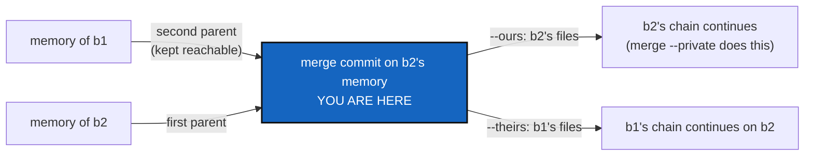

# UnrelatedHistoryMerge — a memory is merged by keeping one side whole, and both sides stay reachable

*Created: 2026-10-08*

*Branch: main*

> **Status — 2026-10-08, worker.** WP0–WP5 are implemented; WP0 is committed
> locally and the rest is committed together with the release (5.1.x). Nothing
> is pushed. Lint, `check-ceilings`, `check-oo`,
> `check-spectree` and the suite (2127 passed) pass, and `cgitsync status`
> shows `errors=0`. Where the code differs from the plan:
> - The shared decision is `MemoryMergeOperation.tree_status` and
>   `keep_in_tree` in the new `operations/memory_merge.py` (Ring 2), not in
>   `MergeOperation`, so `merge`, `merge --into` and `pull --private` call
>   one place and `operations/merge.py` stays under the 500-line ceiling
>   (494 counted lines; the file itself is longer, because the ceiling counts
>   code lines). The git work
>   (plan, commit, move the branch) is there too; `MemoryCommands.memory_merge`
>   only adds the workspace parts (fold, branch names, push).
> - `memory_commands.py` ends at 1989 lines, so §3.4's allowance for a
>   single-class module over 2000 lines was **not needed here**. WP0 landed
>   anyway, as the owner decided, with tests for both cases.
> - New statuses are `kept`, `up-to-date` (the memory) and `unrelated`
>   (any other repository). `merge --resolve` also gets `kept`/`up-to-date`
>   (it would otherwise have started Git-merging a memory) and stops at
>   `unrelated` exactly as it stopped when that was reported as a conflict;
>   what that stop does next is still MergeErgonomics.
> - A push the remote would reject after the local merge is reported as
>   "merged here, but pushing … was refused", with nothing forced.
> - Tutorial 6 §3, §5.1, Step 5, the summary table and the user guide and API
>   docs are corrected (WP5). Line baselines were raised for the modules this
>   extends (`cli/expert.py`, `cli/help_text.py`, `git_runner.py`,
>   `operations/__init__.py`, `merge.py`, `restart.py`, `client.py`,
>   `memory_commands.py`, `tree_commands.py`) and are **awaiting the owner's
>   approval**.
> - An independent orchestrator quoted it at 92/100, found no data-loss bug and
>   two low-severity edge cases, both fixed with tests: a memory on a detached
>   HEAD that already holds the source answers `up-to-date`, and `pull
>   --private` judges a non-memory repository by the very ref it merges
>   (`origin/<base>`). It recorded the self-history entry and chose `minor`
>   (new command `memory merge`).

> **Ticket review — 2026-10-08, owner's decision.** Renumbered `main_1-3` → `main_1-1`: each priority is one pile counted across branches (TICKETLIFECYCLE §2), which this backlog had numbered per branch. Pile 2 order: AutofixBlindSpot, PackageHygiene, the seven data-repo tickets, Omniscience, WorkingAreaRename, StateLocking; ahead of MergeErgonomics, which reuses its helper and comes after it.

> From two owner requests of 2026-10-08, made in conversation and filed as
> [unrelated-memory-merge](../archive/.closedUserTicket/20261008_unrelated-memory-merge.md)
> and [memory-merge](../archive/.closedUserTicket/20261008_memory-merge.md):
> `merge --private`/`--all` treats `.memory` like any other repository and,
> on two memories with unrelated histories, offers `--resolve`. Add
> `cgitsync memory merge b1 into b2 [--ours (b1) | --theirs (b2)]`, which
> preserves a branch's memory while merging, and consider reading
> `merge --private b1 into b2` as `memory merge b1 into b2 --theirs` for
> `.memory` only. Found during GtsHashRepoPrecision's genesis; that ticket
> is finished and is not reopened for this.
>
> **Owner, 2026-10-08:** D1 and D2 accepted as recommended — Git's meaning
> of `--ours`/`--theirs`, and `--into` as an option. `memory_commands.py`
> holds one class, so it is not split: the 2000-line limit is raised for a
> module that holds a single class (§3.4).

## Abstract — read this first

**The one-line version.** A memory is never merged file by file. `memory
merge b1 --into b2 --ours|--theirs` keeps one side's memory whole and
records the other as a second parent, so nothing is lost and nothing is
rewritten; a tree-wide `merge` does the same for `.memory`, with `--ours`
(the target's).

**What this document is.** What happened (§1), premises (§2), what changes
(§3), work packages (§4), decisions (§5, settled), acceptance (§6).

**Why it exists.** After `memory reboot` on a project branch, that branch's
memory is a fresh orphan. `merge --private`/`--all` then reports `.memory:
(conflicts — would block the merge)` with `(no file named)`, sends the user
to `--resolve`, and blocks every other private repository. Worse, even two
*related* memories cannot be merged file by file: each ledger is a chain of
`<seq>.toml` files plus `HEAD`, so a Git merge either collides on the same
names or interleaves two chains into one that no longer verifies.

**Who it is for.** The worker and orchestrator who implement it.

**What you need to do with it.** Re-check §2 against `HEAD`, then do §4.

---

## 1. What happened (owner's tree, 2026-10-08)

1. `memory reboot` on `memory-dev` archived `ComplexGitSync_memory-dev` and
   created a fresh, orphan branch under the same name.
2. `cgitsync merge --all memory-dev --dry-run` from `main` printed
   `.memory <- ComplexGitSync_memory-dev (conflicts — would block the
   merge)`, `.memory: (no file named)`, and "Resolve these files, or Run
   'cgitsync merge --resolve <branch>'".
3. The real `merge --private main` on `memory-dev` refused the whole tree
   for the same reason. `.localSpec`, `.claude` and `.dev` had to be merged
   by hand with `git merge`.
4. `branch delete tmpPyPi` reported `.memory: needs ancestor … 4 ledger
   entries (seq 126-129), 4 State file(s)` — a memory branch whose content
   no other branch holds, because nothing ever merges memories.

No ledger was spliced: the tree merge never passes `allow_unrelated`. The
defects are the diagnosis, the advice, the blocking, and that a branch's
memory has no way to be kept when its project branch is merged.

## 2. Premises (checked at `cfa572d`, 2026-10-08)

| # | Premise | Where |
|---|---|---|
| P1 | `can_merge_cleanly` returns `is_clean=False` with no paths when the two refs share no history — the same answer as a conflict that names no file | `git_runner.py:1031-1100` |
| P2 | Both merge plans turn that into status `"conflicts"`: `merge` and `merge --into` | `operations/merge.py:135`, `:335` |
| P3 | The preview prints `(conflicts — would block the merge)` / `(no file named)` and recommends `--resolve` | `cli/expert.py:1978`, `:2079`, `:2114-2124` |
| P4 | The tree merge never allows unrelated histories, so Git itself refuses | `git_runner.py:993`; no caller in `operations/` passes `allow_unrelated` |
| P5 | The one deliberate unrelated merge is `memory adopt` joining a memory to its base | `orchestre/memory_commands.py:648`, `:653` |
| P6 | `merge_base` answers "no common commit" as `None` | `git_runner.py:397` |
| P7 | The memory mount is known by path | `memory/repository.py:206` (`MemoryRepository.mount_path`) |
| P8 | A conflict in any repository refuses the whole tree (all-or-nothing) | `operations/merge.py:270` |
| P9 | `pull --private` makes the same check and the same refusal | `operations/restart.py:326`, `:336` |
| P10 | A ledger is one file per entry, `<seq:06d>.toml`, plus `HEAD`; every chain starts at `000001` | `memory/ledger_store.py:17`, `:227-229` |
| P11 | `commit_keeping_tree(base, other)` already builds a merge commit that keeps *base*'s tree with *other* as second parent, without a checkout and without moving a ref; `branch close` uses it for `ancestors` | `git_runner.py:1376-1389`, `operations/ancestors.py:278` |
| P12 | A project branch's memory lives on the derived branch `<default_branch>_<branch>` of `.memory` | `cli` help of `merge`, *branch* argument; `memory_commands.py:888` (`memory_branch`) |
| P13 | `memory_commands.py` is 1931 lines and holds exactly one class, `MemoryCommands`; the new method takes it past 2000, where today's rule demands a directory split per class — impossible with one class | `orchestre/memory_commands.py:93`; `scripts/check_oo_conformance.py:61` (`_LINE_CAP`), `:224-231` |
| P14 | Outside `cli/`, a module over 2000 lines fails outright, with no baseline; only `cli/expert.py` is recorded (2501) | `scripts/check_oo_conformance.py:226-231`, `scripts/oo_conformance_baseline.json` |
| P15 | The rule is stated in *Module shape* and in the digest | `AdditionalSpecs.md` §Module shape (*Over 2000 lines, a module becomes a directory*), `digest.md:56` |

## 3. What changes

### 3.1 `cgitsync memory merge`

`cgitsync memory merge b1 [--into b2] --ours|--theirs` (§5 D1, D2). *b1*
and *b2* are **project** branches; the command acts on their derived memory
branches (P12). Without `--into`, *b2* is the project branch checked out,
as `merge` does. `--ours` keeps *b2*'s memory (the branch merged into),
`--theirs` keeps *b1*'s — Git's meaning.

1. Fold and push what is pending on the memory branch checked out, as
   `memory reboot` does first — nothing recorded is lost to the merge.
2. Build one merge commit on *b2*'s memory branch with *b2*'s tip as first
   parent and *b1*'s tip as second parent (`allow_unrelated` in effect,
   since the two may share nothing):
   - `--ours` (keep *b2*): the tree is *b2*'s — `commit_keeping_tree(b2,
     b1)` as it exists (P11). *b2*'s chain, States and `verify` answer are
     unchanged; *b1*'s whole memory becomes reachable from *b2*.
   - `--theirs` (keep *b1*): the tree is *b1*'s; a sibling of
     `commit_keeping_tree` taking the second parent's tree. *b1*'s chain
     continues on *b2*; *b2*'s former memory stays reachable as first
     parent.
3. Move *b2*'s memory branch to that commit — a fast-forward, since the
   commit descends from *b2* — update the mount's worktree if *b2* is the
   one checked out, and push without force.
4. Exactly one of `--ours`/`--theirs` is required: which chain continues is
   never guessed.

Nothing is rewritten, nothing is spliced: the result's files are one
side's, intact, so `verify` reads one chain. The other side is history, as
an archived chapter is after `memory reboot`. Reading it through the memory
commands (`memory list`, `explore`) is not in this ticket.

### 3.2 Tree-wide `merge` and `pull --private` (the owner's question)

**Yes, it makes sense, with one condition.** `merge --private`/`--all` (and
`merge --into`) handles `.memory` as `memory merge <source> --into <target>
--ours`, instead of a file-by-file Git merge — for related *and*
unrelated memories, since P10 makes a file-by-file merge invalid either way:

- the target branch's memory keeps its own chain, so `verify` on it does
  not change;
- the source branch's memory is kept reachable, so `branch close`/`delete`
  of the source then finds its memory commits on another branch (§1 step 4
  stops happening);
- `.memory` no longer blocks the other private repositories (P8).

The condition: the preview and the run say what happens to `.memory` in
those words — "kept b2's memory; b1's is kept as history" — never
"merged". `pull --private` (P9) does the same with the remote as source.

### 3.3 Any other repository with no common commit

A new plan status `unrelated` (`merge_base` is `None`, P6), decided before
`can_merge_cleanly`, refuses the tree by name — "<repo>: <source> and
<target> share no commit; Git will not merge unrelated histories" — and
never recommends `--resolve`. One helper decides the status for
`merge`, `merge --into` and `pull --private`, so they cannot disagree.

### 3.4 The 2000-line rule, for a module with one class (owner)

The rule exists so a large file is split along its classes, one major
class per file. A module holding a **single behaviour class** has nothing
to split along. Such a module may pass 2000 lines; it is then recorded in
`over_2000_lines` at its size, like `cli/expert.py`, and the ratchet
holds it there — growing it again is a deliberate baseline raise, made by
the owner. A module with **more than one** behaviour class past 2000 lines
still fails outright and becomes a directory, one major class per file.
`memory_commands.py` (one class, P13) takes the first path: `memory_merge`
is a method of `MemoryCommands`, beside `memory_reboot`.

## 4. Work packages

| WP | Files | Change |
|---|---|---|
| **WP0** | `scripts/check_oo_conformance.py`, `scripts/oo_conformance_baseline.json`, `AdditionalSpecs.md` §Module shape, `digest.md:56` | §3.4: a single-behaviour-class module over 2000 lines is recorded and ratcheted instead of failing; more than one class still fails. Unit tests for both cases in `tests/unit/test_oo_conformance.py`. Lands first, as its own commit |
| **WP1** | `orchestre/memory_commands.py`, `git_runner.py` | `MemoryCommands.memory_merge` with the §3.1 steps; the `--theirs` sibling of `commit_keeping_tree` (`git_runner.py` is 1776 lines, one class, within the limit). `ComplexGitSyncClient.memory_merge(cgshome, source, *, into=None, keep="ours"\|"theirs")`. Record `memory_commands.py`'s new size in the baseline (§3.4) |
| **WP2** | `cli/expert.py`, `cli/help_text.py` | `memory merge <branch> [--into TARGET] --ours\|--theirs` (exactly one required), help, output |
| **WP3** | `operations/merge.py`, `operations/restart.py` | `.memory` routed to WP1 with `--ours`, keeping the target (§3.2, D3); `unrelated` status for every other repository (§3.3) |
| **WP4** | tests | Unit: the plan says `unrelated`, not `conflicts`, when `merge_base` is `None`; both trees of WP1's commit. Integration: the owner's §1 sequence replayed — `merge --all` merges `.localSpec`/`.claude`/`.dev`, keeps the target memory byte for byte, makes the source memory reachable, and `branch delete` of the source then reports `.memory` safe; `memory merge --theirs` continues the source chain on the target and `verify` is `VERIFIED`; `memory merge --ours` leaves the target's files unchanged; neither flag, or both → refused; an unrelated non-memory repository refuses the tree by name; `memory adopt` (P5) unchanged |
| **WP5** | `docs/Text/user_guide.tex`, `docs/Text/api_python.tex`, `tutorials/06_memory.md` | The new command and client method (checklist step 7); one paragraph on why a memory is never merged file by file; Tutorial 6 §3 and §5.1 stop saying the memory merges file by file (`tutorials/06_memory.md:286-303`, `:450-466`) — this ticket makes them false |

The eight checklist steps apply (`cgitsync-dev.md`). A new command is at
least a `minor`.

**Not here:** the two `--resolve` paths (`merge_tree_one_at_a_time` and
`--all-conflicts`), their loop on an unrelated repository and their
automatic regeneration, and Tutorial 7 on merge. They are
[MergeErgonomics](main_1-2_MergeErgonomics_DevPlanTicket.md), which
reuses this ticket's helper and comes after it.

## 5. Decisions (settled by the owner, 2026-10-08)

| # | Question | Decision |
|---|---|---|
| D1 | Flag names | **Git's meaning.** When *b1* is merged into *b2*, `--ours` keeps *b2* (the branch merged into), `--theirs` keeps *b1*. The first request's spelling (`--ours` = *b1*) was the reverse, and every Git user would have read it backwards. A tree-wide `merge` is therefore `memory merge … --ours` for `.memory` |
| D2 | `into` | **An option:** `cgitsync memory merge b1 [--into b2] --ours\|--theirs`, as `merge --into TARGET`; the CLI grammar allows no positional `into` |
| D3 | Default for the tree-wide `merge` | `--ours` (keep the target): a tree merge never changes which chain the target verifies |
| D4 | `--allow-unrelated` on the tree `merge` for other repositories | No: a rare, deliberate Git operation a user can run by hand |
| D5 | `memory_commands.py` past 2000 lines | Not split: it holds one class. The limit is raised for single-class modules (§3.4) |

## 6. Acceptance

1. The owner's §1 sequence, replayed in a test, never prints "conflicts",
   "(no file named)" or `--resolve` for `.memory`, and merges every other
   private repository.
2. After a tree `merge`, the target memory's files are byte for byte what
   they were, `verify` answers as before, and the source memory's tip is an
   ancestor of the target memory's tip.
3. `branch delete` of the merged source branch reports `.memory` safe.
4. `memory merge --theirs` continues the source chain on the target, and
   `verify` is `VERIFIED`; `--ours` leaves the target's files unchanged.
5. No command rewrites or force-pushes a memory branch.
6. An unrelated non-memory repository refuses the tree by name, nothing
   merged; `pull --private` behaves like `merge`.
7. `check_oo_conformance` passes with `memory_commands.py` recorded in
   `over_2000_lines`, and still fails a multi-class module over 2000 lines.
8. `pixi run lint`, `pixi run test`, `check-ceilings`, `check_oo_conformance`
   and `cgitsync status` with `errors=0`.
