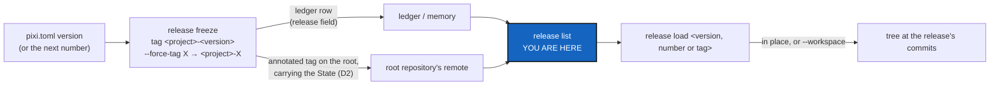

# ReleaseCommand — `cgitsync release freeze | list | load`, a `<project-name>-<version>` tag, and a release any user can find and reload

*Created: 2026-10-09*

*Branch: main*

> From the owner's short ticket
> [release-management](../archive/.closedUserTicket/20261009_release-management.md)
> (2026-10-09): managing a release is complex enough to be a command of its
> own, `cgitsync release`, with at least `freeze`, `list` and `load`. `freeze`
> may be the existing `freeze_release` method if that keeps the refactoring
> small. `list` should read the ledger and so not depend on who made the
> release. Tutorial 2 should then guide the user through reloading a release
> made long before **by another user**, not a local one, which reinforces the
> release process.
>
> **Owner, 2026-10-09, on this plan (first round):** `release freeze` tags
> automatically with the project name and its SemVer; a tag of the user's
> own needs `--force-tag <tag-name>`. This avoids confusion in a Git
> repository that several projects use.
>
> **Owner, 2026-10-09 (second round):** the version comes from the project's
> `pixi.toml`, as it is, even when it is only a build version. With no
> version there, which would be surprising, the release is numbered: `i + 1`,
> `i` read from `release list`. `--force-tag` gets `<project-name>-` put in
> front of it automatically. Readability wins: the tag is
> `<project-name>-<version>`, and so is the commit-message prefix.
> ComplexGitSync's own releases are `ComplexGitSync-<semver>`.

| | |
|---|---|
| Predecessor | [ReleaseTags](../archive/20261007_ReleaseTags_DevPlanTicket.md): `freeze-release` leaves the tree on its branches and pushes the branch with the tag (4.2.4) |
| Touches | DataArchitecture, DataPublication and DataAcceptance name the commands; they now say `release freeze` and `release load` (§8, WP8). The shared `AgentConduct.md` §2 states the commit prefix (§5, D9) |

## Abstract — read this first

**The one-line version.** `freeze-release <name>` becomes `release freeze`,
which names the release itself. The tag is `<project-name>-<version>`, the
version read from the project's `pixi.toml`, or `<project-name>-<n>`, the
next number, when there is none. A tag the user chooses also carries the
`<project-name>-` prefix. `release list` shows every release of the project,
whoever made it, and `release load` puts the tree back at one. The commit
prefix takes the same separator: `<project-name>-<version>`.

**What this document is.** The request (above), what is wrong today (§1),
premises (§2), the command (§3), the release's tag (§4), the commit prefix
(§5), where a release is read from (§6), what else changes (§7), work
packages (§8), decisions (§9), acceptance (§10).

**Why it exists.** Today a release is one hyphenated command, which the CLI
grammar forbids. Its tag is any name the user types, so two projects that
mount one repository can both tag it `v1.0`: the second is refused, or a
reader cannot tell whose release the tag is. Nothing lists or reloads a
release. Tutorial 2 has the user copy a `.gts` out of `.cgitsync/state/` by
hand, which works only on the machine that made the release. The ledger
reaches another user only through a pushed memory, and a USER tree, such as
Tutorial 2's sandbox, never pushes its memory.

**Who it is for.** The worker and orchestrator who implement it, and the
owner for the decisions still open in §9.

**What you need to do with it.** Answer §9's open decisions first: D1 and
D2 decide where `list` and `load` read from, and D9 where the commit-prefix
rule is changed. Then re-check §2 against `HEAD` and follow §8 in order.



---

## 1. What is wrong today

| # | Defect | Severity |
|---|---|---|
| F1 | No command lists the releases. `memory list` shows States with their commands (`freeze_release` among them), but no release name, and only the States of this workspace or of one memory chapter | High |
| F2 | No command reloads a release by name. The user must find the State's hash, copy `.cgitsync/state/<hash>.gts` out by hand, and `bootstrap` it (Tutorial 2, Step 8) | High |
| F3 | A release made by someone else cannot be found in a USER tree: its ledger row and its State live only on the disk that made them. The tags reach the remotes, but a tag alone cannot rebuild the tree (F4) | High |
| F4 | `checkout <tag> --ref-kind tag` is not a reload: read-only configuration repositories are never tagged (the freeze scope is `WRITABLE`), and a repository added or removed since the release is wrong | Medium |
| F5 | The tag is whatever the user types. A repository mounted by two projects gets both projects' tags in one namespace: the same name is refused for the second project (P4), and a different one does not say which project it belongs to | Medium |
| F6 | `freeze-release` breaks the CLI grammar: a hyphen glues a command to what is in effect its subcommand (DevSpecs, *CLI Grammar*) | Medium |
| F7 | The release carries no project version. The row's `semver` is ComplexGitSync's own `__version__`, which is misleading when shown as the release's version | Low |

## 2. Premises (checked at `8928216`, 2026-10-09)

| # | Premise | Where |
|---|---|---|
| P1 | `freeze_release(release_name, …)` runs `add → commit → pull → push → freeze` and writes a `release` row (`semver`, `git_tag`, `artefact:src`, optionally `artefact:agent_contract`) on the ledger entry | `orchestre/client.py:642`, `orchestre/memory_commands.py:184` |
| P2 | `memory_commands.py` is 1989 lines, just under the 2000-line split line | `wc -l` |
| P3 | The tag is lightweight (`git tag <name>`), created and pushed leaf-first over the `WRITABLE` scope | `git_runner.py:1618`, `operations/push.py:190` |
| P4 | A tag name already taken in any repository is refused before anything moves | `operations/preflight.py:181` |
| P5 | `freeze-release` is a minimalist command; its handler only loads the tree, prints, and calls the client | `cli/minimalist.py:47`, `:147`, `:346`, `:570` |
| P6 | `memory list` reads the local ledger, or one other chapter from Git; `MemoryChapters.find_state` finds a State in any chapter the memory repository still reaches | `orchestre/memory_commands.py:1518`, `orchestre/memory_chapters.py:140`, `:161` |
| P7 | A USER tree's memory never leaves the disk; only a DEV memory is synced | `AdditionalSpecs.md`, *The tree profile* |
| P8 | Restoring a `.gts` in place exists in the API (`launch_state` → `_restore_gts_snapshot`) but has no command; `bootstrap <state.gts>` rebuilds a new workspace | `orchestre/client.py:666`, `:1027` |
| P9 | Tutorial 2 runs on the CGSil1 sandbox, which declares no memory (a USER tree) and has no `pixi.toml`; Step 7 releases `v1.0`, Step 8 copies the `.gts` by hand and bootstraps it in a second workspace. Its test replays that | `tutorials/02_working_with_a_tree.md:146-230`, `tests/integration/test_tuto_cgsi1.py:289` |
| P10 | `freeze-release` is named 26 times in the README, the tutorials and the LaTeX docs, and in 14 test files | `grep -rn freeze-release` |
| P11 | Removing or renaming a command, or changing what an exit code means, is a MAJOR change; adding one is MINOR | `.dev/Versioning.md`, *The scheme* |
| P12 | Every tree has a project name (`project.name` in the `.cgs`, `GitTree.project_name`); this project's is `ComplexGitSync`. No `.cgs` or `.gts` field holds a project version | `cgs_format.py:686`, `git_tree.py:409`, `install.cgs:27` |
| P13 | This project's `pixi.toml` holds `[workspace] version = "5.1.3"`, kept in step by `bump-version`; older Pixi manifests use `[project]` instead of `[workspace]` | `pixi.toml:1-3`, `.dev/Versioning.md`, *bump-version* |
| P14 | `cgitsync commit` checks the prefix `<stem><version>`, no separator, with the version read from `pyproject.toml`'s `[project]`, and binds only a tree that holds `AgentConduct.md` | `commit_message.py:77`, `:143` |
| P15 | The prefix rule is stated in `AgentConduct.md` §2, in the shared `dev-sync` mount, which is read-only here; this project repeats it in `CLAUDE.md`, `digest.md`, `AdditionalSpecs.md` and `.dev/Versioning.md` | `grep -rn "cgitsync<version>\|<project-name><version>"` |

## 3. The command

```
cgitsync release freeze <message> [--force-tag TAG] [--gts FILE] [--dry-run] [--force-access-protocol P]
cgitsync release list   [--json]
cgitsync release load   <version | number | tag> [--workspace NAME]
```

| Subcommand | Client method | Does |
|---|---|---|
| `freeze` | `freeze_release()`, kept by name (the owner allows it); `release_name` becomes the keyword `force_tag=None` | What `freeze-release` does today, with the tag named by §4, and the root tag's State (D2) |
| `list` | `list_releases()` | Every release of this project, newest first: tag, version, recorded time, who made it, the State, and where each was read from (ledger, memory chapter, root tag). The tool's version shows only as "made with cgitsync X.Y.Z" (D5) |
| `load` | `load_release(name, workspace=None)` | Takes what follows the prefix (`1.2.0`, `3`, `beta`) or the whole tag (`CGSil1-3`), finds the release and its State, and restores it: in place by default, refusing a dirty tree by name; with `--workspace`, into a new workspace as `bootstrap <state.gts>` does (D3). Records a ledger entry (`release_load`) like any command that changes the tree |

`list` and `load` read; neither writes to a remote. `load` never moves a
branch: each repository is left detached at the recorded commit, and
`checkout <branch>` goes back to work, as after `checkout <tag> --ref-kind tag`.

**Code shape.** A new `orchestre/release_commands.py` with one class,
`ReleaseCommands`, holding all three. `freeze_release`'s body moves there,
changed only for §4, so `memory_commands.py` shrinks away from the split
line (P2). A small `ProjectVersion` class reads the version from the root's
`pixi.toml`. It is the one reader of a project's version, used by both
`release freeze` and the commit check (§5). The client keeps one delegate
per method. The CLI group goes in `cli/`, and `cli/minimalist.py` loses
`freeze-release`'s parser and handler (D4).

## 4. The release's tag

**Always `<project-name>-<suffix>`**, the project name read from the tree
(P12). The same tag lands in every repository the release touches, and a
repository that several projects mount carries each project's releases
under that project's own name: `A-1.0.0` and `B-1.0.0` never collide, and a
reader sees whose release a tag is. The suffix is, in order:

| Case | Suffix | Example |
|---|---|---|
| `--force-tag X` | `X`. The prefix is added automatically; `X` that already starts with `<project-name>-` is not prefixed twice | `CGSil1-beta` |
| The root's `pixi.toml` has a version (`[workspace]`, else `[project]`) | That version, as written: SemVer or a build version alike | `ComplexGitSync-5.2.0`, `Widget-2026.07` |
| No version there | `n + 1`, `n` being the highest number among this project's releases in `release list`, `0` when there are none. Forced and versioned releases do not use up a number | `CGSil1-1`, then `CGSil1-2` |

**A version released twice is refused** like any taken tag (P4). The
refusal says the version comes from `pixi.toml` and must be bumped there, or
the release named with `--force-tag`. It also names the project that holds
the tag, read from the root tag's message when there is one.

**The release row** gains two additive keys: `project` (the project name)
and `project:version` (the `pixi.toml` version, absent when there is none).
Both are absent on older entries, so every chain already written still
verifies byte for byte, and the existing `semver` key keeps meaning the
tool's version.

`release freeze --dry-run` prints the tag, and where its suffix came from,
before anything moves.

## 5. The commit-message prefix

The owner's second round extends the separator to commit messages:
`<project-name>-<version>`, for example `ComplexGitSync-5.2.0 …` (D10). It is
the same name and the same version as the release tag, so `git log` and
`git tag` read alike.

- `cgitsync commit`'s check (`commit_message.py`) accepts `<stem>-<version>`
  and refuses the old form without the separator, naming the new form. The
  version comes from `ProjectVersion` (`pixi.toml`), the same reader as
  §4. The accepted name stems stay what they are: the project name and its
  console-script names. History is never rewritten: old messages stay as
  they are.
- The rule's own statement is in the shared `AgentConduct.md` §2 (P15),
  which is read-only here and used by other projects too (D9).
- This project's copies change in the same change: `CLAUDE.md` step 8,
  `digest.md`, `AdditionalSpecs.md`, `.dev/cgitsync-dev.md` step 8 and
  `.dev/Versioning.md`.
- **The commit that lands this ticket is the first to use the new prefix**,
  because its build refuses the old one.

## 6. Where a release is read from

The ledger is the release register (`.dev/Versioning.md`, *The release
register*) and stays so: it is tamper-evident and holds the full State. But
it reaches another user only through a pushed memory (P7). A release must
also travel with the project itself, so that a USER tree, or someone who
has never seen the memory, can find and reload it.

| Source | Reaches | Holds | Used for |
|---|---|---|---|
| Local ledger | This workspace | The full row and State | Always |
| Memory chapters in Git | Every DEV user who pulled the memory | The full row and State | DEV trees (P6) |
| Root repository's annotated tag | Anyone who can fetch the project | Project name, version, and the State restricted to project-scope repositories (D2) | Every tree, and the only source in a USER tree |

`list` merges the three by tag. The ledger wins when both hold a release. A
root tag counts as this project's release when its message names this
project, so tags another project put on a shared root are not listed. A tag
made before this change (lightweight, no message) is listed as "tag only"
when it is not in the ledger. It cannot be loaded, and the row says to use
`checkout <tag> --ref-kind tag`.

**Private repositories never reach a public tag.** The tag's State holds
only the project-scope repositories. A DEV tree's private repositories and
their addresses stay in the ledger and the memory, never in the root tag.

## 7. What else changes

1. **Tutorial 2, Steps 7–8.** Step 7 runs `release freeze "first release
   of the sandbox"` and shows the tag it chose: `CGSil1-1`, since the
   sandbox has no `pixi.toml` (P9). One paragraph explains the three cases
   of §4 and why the project name is in the tag. Step 8 becomes "reload a
   release someone else made": the second workspace, bootstrapped from the
   `.cgs` as a colleague would, has never seen that release. It runs
   `release list`, finds release 1 made by the first workspace, and runs
   `release load 1`. The hand copy of the `.gts` goes, and so does the old
   way of looking at a release in place (`checkout v1.0 --ref-kind tag`).
   The summary table gains `release list` and `release load`.
2. **Every other mention.** `README.md:99` (the use-case row), Tutorials 4
   and 5, `tutorials/README.md`, and the user guide: a `\subsection` for
   `release` with its three subcommands replaces the one for
   `freeze-release`, and the *What is stable* table follows D4. The API docs
   gain `list_releases` and `load_release`, and document `force_tag`.
3. **Open tickets.** DataArchitecture (M5), DataPublication and
   DataAcceptance name the CLI commands as `release freeze` and
   `release load`. Their `freeze_release()` references stay, since the
   method keeps its name.
4. **Specs, at implementation time (step 6).** `AdditionalSpecs.md`'s module
   table gains `release_commands.py` and `ProjectVersion`, and its
   entry-schema table gains the `project` and `project:version` keys.
   `.dev/Versioning.md`'s release register drops the `v<semver>` tag for §4
   and adds the root tag as the release's portable copy. The digest gains
   two lines: a release tag is `<project-name>-<suffix>`, forced or not,
   and a release tag never carries a private repository. Its commit-prefix
   line follows §5.

## 8. Work packages

| WP | Files | Change |
|---|---|---|
| **WP0** | tests | Failing tests first: a second workspace bootstrapped from the CGSil1 `.cgs` cannot list or load a release the first one made (F1–F3); two projects mounting one repository cannot both release `v1.0` (F5) |
| **WP1** | `orchestre/release_commands.py`, `orchestre/client.py`, `orchestre/memory_commands.py` | `ReleaseCommands` with `freeze_release` moved in; client delegates |
| **WP2** | the module holding `ProjectVersion` (placed by the module-shape rule) | Reads `[workspace].version`, else `[project].version`, from the root's `pixi.toml`; `None` when there is no file or no version |
| **WP3** | `release_commands.py`, `memory/ledger_entry.py` | §4: the suffix (forced, version, or next number), the tag, the refusal for a version released twice, the `project` and `project:version` keys |
| **WP4** | `operations/push.py`, `git_runner.py`, `operations/preflight.py` | D2: the root repository's tag becomes annotated, its message the project name, the version and the project-scope State; the other repositories keep lightweight tags. The State is computed before the root is tagged, since tagging changes no commit. The taken-tag refusal names the owning project |
| **WP5** | `release_commands.py` | `list_releases()`, merging the three sources of §6 and keeping only this project's; `load_release()`: resolve a suffix or a whole tag, restore in place through `_restore_gts_snapshot` or into a new workspace through `bootstrap`, refuse a dirty tree, an unknown name and a tag-only release, each by name |
| **WP6** | `commit_message.py` | §5: `<stem>-<version>`, the version from `ProjectVersion`; the refusal names the new form |
| **WP7** | `cli/`, `cli/help_text.py`, `cli/minimalist.py` | The `release` group with help and examples; `freeze-release` per D4 |
| **WP8** | tutorials, `README.md`, `docs/Text/*.tex`, open data tickets, local specs | §5 and §7 |
| **WP9** | tests | WP0 passes; the three suffix cases and their order, numbering after forced and versioned releases, a build version used as written, a version released twice; `list` in a USER tree, a DEV tree with a pushed memory, and a mix with a pre-change tag; `load` by suffix and by tag, in place and `--workspace`; a DEV release tag holds no private repository; older ledgers verify unchanged; the commit check accepts `ComplexGitSync-5.2.0` and `cgitsync-5.2.0` and refuses `cgitsync5.2.0` |

The eight checklist steps apply (`cgitsync-dev.md`). Changing what the
commit check accepts, and removing `freeze-release`, are breaking (P11): a
`major` bump, 6.0.0 (D4).

## 9. Decisions

**Settled by the owner, 2026-10-09**

| # | Question | Answer |
|---|---|---|
| D6 | Where does a release's version come from? | The root's `pixi.toml`, as written, even a build version; with none, the next number from `release list` |
| D7 | Is there a separator? | Yes, `-`, for readability: `<project-name>-<version>`, in tags and in commit prefixes |
| D8 | ComplexGitSync's own releases | `ComplexGitSync-<semver>`. It follows from §4 with no special case: the `.cgs` names the project `ComplexGitSync`, and `bump-version` keeps `pixi.toml` current |
| — | A tag of the user's own | Only with `--force-tag`, and it is always prefixed `<project-name>-` |

**Open**

| # | Question | Recommendation |
|---|---|---|
| D1 | Is the ledger the only source of `list`, as the short ticket hopes? | **No: ledger first, plus the root tag.** The ledger alone cannot list another user's release in a USER tree (P7), which is exactly Tutorial 2's case |
| D2 | How does a release travel with the project? | **The root repository's annotated tag carries the project name, the version and the project-scope State.** A `releases/<name>.gts` committed to the root was considered and rejected: the commit would change the root SHA the State records. A tag alone was rejected because it cannot rebuild the tree (F4) |
| D3 | Does `load` restore in place or into a new workspace? | **In place by default, `--workspace NAME` for a new one.** In place is what "go back to a release" means. The new workspace is today's Tutorial 2 path, kept for comparing two releases side by side |
| D4 | What happens to `freeze-release`? | **Remove it, in a 6.0.0.** An alias can no longer behave as it did, because its tag now gains the prefix. The commit check's new prefix is a breaking change anyway. The typo suggestion points to `release freeze` |
| D5 | Does `list` show the row's `semver`? | **Only as "made with cgitsync X.Y.Z".** The release's own version is `project:version` (§4, F7) |
| D9 | `AgentConduct.md` §2 is shared and read-only here: where does the new prefix get stated? | **Change the shared rule itself**, in the `DevSpec` repository, as its own change pushed by the owner, never bundled with this project's commit. Until it lands, `cgitsync-dev.md` records the separator as this project's exception, so the fill-in and the checker agree |
| D10 | Which name does the commit prefix use for this project: `ComplexGitSync-` or `cgitsync-`? | **Accept both, as today**, and write `cgitsync-<version>` in this project's own messages, keeping the stem people already read in `git log` |

## 10. Acceptance

1. `cgitsync release --help` lists `freeze`, `list` and `load`, and each
   mirrors one client method.
2. `release freeze` tags every repository it touches
   `<project-name>-<version>` from the root's `pixi.toml`, or
   `<project-name>-<n + 1>` with no version there; `--force-tag X` gives
   `<project-name>-X`; `--dry-run` shows the tag first.
3. Two projects that mount one repository release without colliding, and
   each `release list` shows only its own.
4. Releasing a version already released is refused, naming `pixi.toml` and
   `--force-tag`.
5. In a workspace that never saw the release, `release list` shows a
   release another workspace made, in a USER tree and in a DEV tree.
6. `release load 1` (or a version, or a whole tag) puts every repository,
   read-only ones included, at the recorded commit, whatever happened on
   its branch since. It refuses a dirty tree, an unknown name and a
   tag-only release by name.
7. No release tag pushed by a DEV tree names a private repository, and
   every ledger written before this change still verifies.
8. `cgitsync commit` accepts `<project-name>-<version>` and refuses the
   form without the separator; every local spec states the new form, and
   D9's shared change is delivered separately.
9. Tutorial 2 teaches reloading another user's release without copying a
   file by hand, and its replay test passes.
10. `freeze-release` is gone, as D4 decides; README, tutorials, user guide
    and API docs agree.
11. `pixi run lint`, `pixi run test`, `check-ceilings`, `check-oo`,
    `check-spectree`, and `cgitsync status` with `errors=0`.
