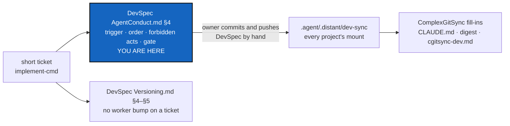

# PairRuleUpstream — the shared pair rule says when it starts, what the worker never does, and that it can be gated

*Created: 2026-10-09*

*Branch: main*

> From the owner's short ticket
> [implement-cmd](../archive/.closedUserTicket/20261009_implement-cmd.md)
> (2026-10-09). It is the text PairRuleGate's WP4 drafted and handed over,
> asking DevSpec's `AgentConduct.md` §4 to make a project state the pair
> rule as orders: the owner's "implement" is the explicit request for the
> orchestrator, the owner's decisions are asked before the first edit, and
> the worker never bumps the version, writes the record or scores itself.
> It also asks §4 to suggest a mechanical gate and to say what such a gate
> cannot prove.
>
> **Owner, 2026-10-09: for this ticket only, the read-only rule on
> `.agent/.distant/dev-sync` is lifted.** The worker edits DevSpec's files in
> that mount directly. The owner commits and pushes DevSpec by hand with
> `git`, separately from every other repository. No `cgitsync` command
> writes to that mount.

| | |
|---|---|
| Predecessor | [PairRuleGate](../archive/20261009_PairRuleGate_DevPlanTicket.md) — ComplexGitSync's own orders, digest lines and gate. Its WP4 said to file a short ticket in DevSpec's `shortTickets/`; DevSpec has none, so this ticket does the edit itself |
| Lands on | DevSpec `main` (`github:flipoyo/DevSpec`, mounted at `.agent/.distant/dev-sync`), then ComplexGitSync `main` for the fill-ins |

## Abstract — read this first

**The one-line version.** Make the shared pair rule bind in every project,
not only in ComplexGitSync. `AgentConduct.md` §4 gains what a project must
state for the rule to work: the trigger, the order of the steps, and the
worker's forbidden acts. It also gains a recommended gate. DevSpec's
`Versioning.md` stops letting a worker bump the release of a ticket's work
"when no orchestrator quotes" it. ComplexGitSync's fill-ins then point to
the pattern instead of standing alone.

**What this document is.** Why the pattern needs it (§1), premises (§2),
what changes in DevSpec (§3), what changes in ComplexGitSync (§4), how the
DevSpec change lands (§5), work packages (§6), decisions (§7), acceptance
(§8).

**Why it exists.** PairRuleGate fixed ComplexGitSync alone. Its §2 found
the cause in the shared rule's wording: a description that loses to the
harness's own order not to launch subagents, with no trigger and no
forbidden steps. Every other project that mounts DevSpec inherits the same
wording and the same failure. SpecTree §2 says that when a pattern needs a
change, the change goes in the pattern.

**Who it is for.** The worker and orchestrator who implement it; the owner
for §7 and for the DevSpec commit.

**What you need to do with it.** Implement it under CLAUDE.md's *When the
owner says `implement <ticket>`*: ask §7 first, then follow §6 in order. The
DevSpec edits are delivered as a diff and a commit message for the owner.

---

## 1. Why the pattern needs it

| # | Gap in DevSpec today | Effect |
|---|---|---|
| G1 | `AgentConduct.md` §4 describes the pair ("implementing a ticket takes at least two agents") but names no moment and no act that starts it | A project copying it gets a description that loses to an order in the harness (PairRuleGate §2, R1–R2) |
| G2 | §4 says nothing about the owner's decisions in a ticket | A worker takes the recommendation as the answer (PairRuleGate E2, R3) |
| G3 | §4's table says what the orchestrator does, not what the worker must not do | The worker runs the release bump itself (PairRuleGate E3) |
| G4 | `Versioning.md` §4 and §5 let the worker bump the release "when no orchestrator quotes the work" and say "No orchestrator does not mean no bump", without limiting this to work that is not a ticket | Read with §4 as it stands, a worker implementing a ticket alone finds written permission to release it |
| G5 | Nothing suggests checking the rule mechanically | Breaking it costs nothing at the moment of output (PairRuleGate R4) |

## 2. Premises (checked at DevSpec `c088c01` and ComplexGitSync `ded24ff`, 2026-10-09)

| # | Premise | Where |
|---|---|---|
| P1 | §4 is one section: the two roles, why the same role bumps the version, what "independent" means, what it is not, and its scope | `dev-sync/AgentConduct.md:178-214` |
| P2 | §4's *Scope* already asks a project to state the scope in its own `CLAUDE.md`; it is the only "a project stating this rule must…" sentence | `dev-sync/AgentConduct.md:210-214` |
| P3 | The abstract, the mermaid graph and `README.md`'s file list describe §4 in one line each | `dev-sync/AgentConduct.md:22-25`, `:44`; `dev-sync/README.md:30-32` |
| P4 | `Versioning.md` §4 gives the worker the `patch` bump "when no orchestrator quotes the work"; §5 adds "No orchestrator does not mean no bump. When the owner asks for a fix directly…" | `dev-sync/Versioning.md:117`, `:143-147` |
| P5 | The mount is `private = true` with no `writable`: read-only to `cgitsync`, the same for every project | `examples/complexgitsync4dev.cgs:87`, `dev-sync/README.md:7-11` |
| P6 | DevSpec has no `DevTickets/` or `shortTickets/` | `ls .agent/.distant/dev-sync` |
| P7 | ComplexGitSync states the orders in `CLAUDE.md` (*When the owner says `implement <ticket>`*); three digest lines cite `CLAUDE.md` for them; `cgitsync-dev.md` points to `CLAUDE.md` | PairRuleGate, `5.2.1` |
| P8 | `CLAUDE.md` still holds the descriptive paragraph after the eight steps that PairRuleGate §4.1 was to replace; the harness refused that edit to the agent | `.agent/.local/.claude/CLAUDE.md:128` |

## 3. What changes in DevSpec

### 3.1 `AgentConduct.md` §4

Two subsections after the existing text. The numbering of §1–§4 does not
move, so every citation of `AgentConduct.md` §4 stays right.

**§4.1 Stating the rule so it binds.** A project that adopts the pair rule
states, in the file its agents load at the start of every session, and as
orders rather than description:

1. **The trigger.** The owner asking to implement a ticket is the explicit
   request to launch the orchestrator, with the tool the project's coding
   harness provides for launching another agent. It needs no further
   permission. The project names the tool. The pattern names no product
   (D2).
2. **The owner's decisions come first.** Every open decision a ticket
   leaves to the owner is asked before the first edit. A recommendation is
   never the answer.
3. **What the worker never does.** It never makes the release-version
   judgement, never writes the record, and never scores its own work.
4. **The loop.** The orchestrator quotes; the worker fixes; the same
   orchestrator re-quotes, until nothing blocking is left.
5. **The end.** Only then is the ticket closed and the commit message
   delivered.

Why a project must state these: an instruction phrased as a description
loses to an order given closer to the moment of action, and a coding
harness usually carries exactly such an order against launching other
agents unprompted. Stating the trigger as the explicit request removes
the conflict instead of hoping it is resolved the right way.

**§4.2 Gating it.** A project whose tooling can should refuse to close a
ticket that has no orchestrator's record, at the moment the work is handed
over (a commit, a merge, a check run before either). Such a gate cannot
prove that the two agents were really separate: one agent can write a
record naming two roles. It turns "forgot" into "refused". A project must
not claim more for it.

**Around it.** The abstract's *What you will find*, the mermaid node for
§4, and `README.md`'s line for `AgentConduct.md` mention the trigger and the
gate.

### 3.2 `Versioning.md` §4 and §5

The worker's `patch` bump "when no orchestrator quotes the work" applies
only to work that is **not** the implementation of a ticket: a fix the owner
asks for directly. When a ticket is implemented, the release bump is always
the orchestrator's (`AgentConduct.md` §4). Both the §4 table row and §5's
"No orchestrator does not mean no bump" say so, in one clause each.

## 4. What changes in ComplexGitSync

1. **`CLAUDE.md`** keeps its ordered block: it is this project's fill-in of
   §4.1, naming the Agent tool, `AskUserQuestion`, `bump-version`,
   `cgitsync self-history add` and `check-tickets`. Its closing line points
   to `AgentConduct.md` §4.1 for why. The descriptive paragraph after the
   eight steps (P8) is replaced as PairRuleGate §4.1 intended, by the
   owner's hand if the harness refuses it again.
2. **`digest.md`**: the decisions-first and worker-forbidden lines cite
   `AgentConduct.md` §4.1, the rule's home. The trigger line keeps citing
   `CLAUDE.md`, which names the tool. The gate line is unchanged.
3. **`cgitsync-dev.md`** §The pair rule points to §4.1 and §4.2 instead of
   describing the gate's limits again.
4. **`.dev/Versioning.md`** (this project's fill-in): only if it repeats the
   "no orchestrator" case without §3.2's limit.

Nothing under `src/` changes, so there is no build or release bump.

## 5. How the DevSpec change lands

- The worker edits `.agent/.distant/dev-sync/AgentConduct.md`, `Versioning.md`
  and `README.md` in place, under the owner's one-time lift above. Nothing
  else under `.agent/.distant/` is touched.
- The orchestrator quotes the DevSpec diff and the ComplexGitSync diff
  together, as one ticket.
- The report delivers **two commit messages**: one for DevSpec, which the
  owner commits and pushes by hand with `git` and never bundles with another
  repository, and one for the ComplexGitSync repositories that changed
  (`.claude`, `.localSpec`, `.dev`).
- Until the owner pushes, `cgitsync status` shows the DevSpec mount dirty
  or ahead. That is expected; `errors=0` is checked again after the push.
- Other projects mounting DevSpec get the new §4.1 on their next pull and
  owe their own fill-in (D4).

## 6. Work packages

| WP | Repository | Files | Change |
|---|---|---|---|
| **WP1** | DevSpec | `AgentConduct.md` | §3.1: §4.1 and §4.2, the abstract line, the mermaid node |
| **WP2** | DevSpec | `Versioning.md` | §3.2: the limit in the §4 table and in §5 |
| **WP3** | DevSpec | `README.md` | The `AgentConduct.md` line mentions the trigger and the gate |
| **WP4** | `.claude` | `CLAUDE.md` | §4.1: the pointer line; the paragraph of P8 (owner's hand if refused) |
| **WP5** | `.localSpec`, `.dev` | `digest.md`, `cgitsync-dev.md`, `.dev/Versioning.md` | §4.2–§4.4 |
| **WP6** | — | — | `pixi run check-spectree` (every citation resolves, AgentConduct still cited), `check-tickets`, `lint`, `test`, `cgitsync status` |

## 7. Decisions for the owner

Ask these before the first edit.

| # | Question | Recommendation |
|---|---|---|
| D1 | Subsections §4.1/§4.2 inside §4, or a new §5? | **Inside §4.** No section moves, so every project's citation of §4 stays right, and the digest line stays one citation |
| D2 | Does the pattern name a tool (Claude Code's Agent tool)? | **No.** DevSpec is for any project and any harness; the pattern says "the tool the harness provides" and each fill-in names its own |
| D3 | Is the gate a MUST or a SHOULD? | **SHOULD, where the project's tooling can.** A project with no tool of its own cannot build one; the trigger and the forbidden acts (§4.1) are the MUSTs |
| D4 | Do other projects mounting DevSpec get a ticket each? | **No ticket from here.** They see the change on their next pull; owing a fill-in is their own planning. This ticket only says so in its DevSpec commit message |
| D5 | ComplexGitSync's `CLAUDE.md` block repeats §4.1 once it exists. Keep it? | **Keep it, recorded as this project's exception** (owner, 2026-10-09, PairRuleGate D4): the orders must sit in the always-loaded file to bind. SpecTree §2 allows a named exception |

## 8. Acceptance

1. `AgentConduct.md` §4.1 states the trigger, the decisions-first rule, the
   worker's forbidden acts, the loop and the end as orders a project must
   state; §4.2 recommends a gate and says what it cannot prove. §1–§4 keep
   their numbers.
2. `Versioning.md` no longer lets a worker make the release bump of a
   ticket's implementation.
3. Nothing under `.agent/.distant/` other than WP1–WP3's files changed, and
   the DevSpec commit message is delivered separately.
4. ComplexGitSync's digest cites `AgentConduct.md` §4.1 where §4.2 says;
   `CLAUDE.md` no longer holds the descriptive paragraph, or the report says
   the owner must remove it.
5. Implemented by a worker and a launched orchestrator, decisions asked
   first, archived with its record (`check-tickets` passes on it).
6. `pixi run lint`, `pixi run test`, `check-spectree`, `check-tickets`,
   and, after the owner's DevSpec push, `cgitsync status` with `errors=0`.
