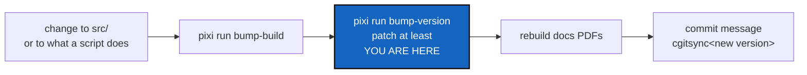

# Versioning — how ComplexGitSync numbers what it releases

*Created: 2026-09-22*

*Fills in: ../../.distant/dev-sync/Versioning.md*

## Abstract — read this first

**The one-line version.** ComplexGitSync uses real SemVer, measured
against the CLI contract in the user guide, plus a build counter. This file
names the files, commands and choices; the rule itself is
[Versioning.md](../../.distant/dev-sync/Versioning.md) in `DevSpec`.

**What this document is.** The fill-in of the shared versioning rule: the
scheme and why, what the public interface is, where each number lives, the
two commands and what they write, what must be rebuilt after a bump, and the
release register.

**Why it exists.** The shared rule leaves these open on purpose, and the
commands and files are this project's. It used to be copied into
`AdditionalSpecs.md` as well, and the two copies drifted. This is now the
only place.

**What you will find.** The scheme and public interface, where the numbers
live, `bump-version`, `bump-build`, and the release register.

**Who it is for.** The worker who changes `src/`, the orchestrator who
chooses the release level, and the owner.

**What you need to do with it.** After any `bump-build`, run `bump-version`
before calling the work done, then rebuild the PDFs and write the commit
message with the new version ([cgitsync-dev.md](cgitsync-dev.md), steps 2, 4,
5 and 8).

---

## The scheme, and the public interface

**Real SemVer** (`MAJOR.MINOR.PATCH`, with an optional `-<stage>.<N>`
pre-release suffix), authoritative in `pyproject.toml`, because this project
publishes a package under exactly the promise SemVer exists to state. **No
workflow writes it.** `.github/workflows/ci.yml` installs, reconstitutes the
tree, lints and tests, and nothing more.

SemVer's positions are defined against a public API, and this project
already has one written down: the user guide's *What is stable, and what is
not* table (`docs/Text/user_guide.tex`, *What `cgitsync` promises a
script*).

| Position | Increments when | From the CLI contract |
|---|---|---|
| **MAJOR** | The public interface breaks | A command or documented flag is removed or renamed; an exit code changes meaning; a `--json` field is repurposed or removed; a `.cgs`/`.gts` grammar change an older reader cannot load |
| **MINOR** | Capability is added, compatibly | A new command, a new flag, a new `--json` field, a new provider — everything the contract calls "additive only" |
| **PATCH** | Behaviour is fixed, nothing added | A bug fix with no interface change |

Two things this narrows a great deal: `src/ComplexGitSync/` is **not a
public interface** (the contract says so outright — an internal refactor
never forces a major bump and owes no deprecation), and `verify` is
**experimental**, so its output changing is not a break either, until it
stops being.

Pre-release identifiers (`3.1.0-alpha.1`, `3.1.0-beta.2`, `3.1.0-rc.1`, then
`3.1.0`) are what `pixi run bump-version`'s `--pre`/`--release` flags
produce.

## Where the two numbers live

| Number | Where | Says |
|---|---|---|
| **SemVer** | `pyproject.toml`, `pixi.toml`, `src/ComplexGitSync/__init__.py`'s `__version__` | What the project promises |
| **Build counter** | `src/ComplexGitSync/__init__.py`'s `__build__` | Exactly which build produced a given ledger entry |

Every change to `src/` bumps the build counter (`pixi run bump-build`,
`scripts/bump_build.py`). The counter keeps the calendar scheme the whole
package used to follow (`YYYY.XX`, `XX` rolling 01→99 into `YYYY+1`) — it is
provenance, never identity, and like every toolchain version never enters a
State's hash (`AdditionalSpecs.md`, *What a State's name is computed from*).
A change outside `src/` that still changes what a command or script of this
repository does (`scripts/`, a pixi task) is released the same way, at
`patch` at least, though it has no build to bump.

## Who bumps what — the commands

| Who | Does | With |
|---|---|---|
| **Worker** | Bumps `__build__`, then `bump-version patch` itself when no orchestrator quotes the work | `pixi run bump-build` — writes one file |
| **Orchestrator** | Decides MAJOR/MINOR/PATCH, runs `bump-version`, tags, writes the release row | `pixi run bump-version {major,minor,patch} [--pre <stage>] [--release]` |
| **CI** | Verifies: lint, tests, tree reconstitution | Never writes a version; `permissions: contents: read` never changes for this |

`bump-build` also prints the next step, so it cannot be missed. An
orchestrator quoting a change can see in the diff whether `bump-build` ran.

## `bump-version`

`scripts/bump_version.py`, in this mount (`.agent/.local/.dev/scripts/`).
Reads the current version from `pyproject.toml`, and writes the version the
caller names — **five targets**:

| File | Field |
|---|---|
| `pyproject.toml` | `[project].version` — the authoritative one |
| `pixi.toml` | `[workspace].version` |
| `src/ComplexGitSync/__init__.py` | `__version__` |
| `README.md` | the version in the title heading (`v<semver>`) |
| `docs/Setup/Shortcuts.tex`, `docs/preamble.tex` | `\newcommand{\cgsversion}{...}` |

Exactly one of a bump level or a pre-release action is required —
`major`/`minor`/`patch` (bumps that position, drops any pre-release suffix),
`--pre <alpha|beta|rc>` (alone, advances an existing pre-release; combined
with a level, starts a new pre-release cycle at `.1`), or `--release`
(finalises a pre-release into its base version). `--dry-run` previews the
`old -> new` transition without writing anything.

**All five files or none.** `apply_version()` reads and rewrites every
target in memory first, and only a complete set of new texts reaches the
disk. A missing file, an unwritable one, or a version field the patterns
cannot find stops the whole bump with nothing changed.

The last two targets live in `docs/`, a separate repository
(`DocComplexGitSync`). When they are absent — a checkout of
`ComplexGitSync` alone — the script runs
`cgitsync initialise examples/complexgitsync4dev.cgs` to clone them into
place, *before* the first write rather than after three of them. Working on
this repository from a standalone checkout is legitimate; releasing from
one is not, which is why `tests/unit/test_bump_version.py` skips its two
docs checks there instead of failing. Those checks assert both that each
`\cgsversion` macro is still reachable by the script's pattern and that its
value equals `pyproject.toml`'s — matchability alone let 2.49 ship with its
documentation left on 2.48.

**Rebuild the PDFs.** `bump-version` rewrites `.tex` sources only. The
tracked PDFs in `docs/` embed the version on their title pages, so after
every `bump-version` rebuild `MASTER.tex` and **every** `c_*.tex`
(`cd docs && latexmk -pdf MASTER.tex c_api_python.tex c_architecture.tex
c_getting_started.tex c_user_guide.tex`), not only the ones whose text you
changed, and commit the result in the same change. This paragraph is the one
statement of the rule; [cgitsync-dev.md](cgitsync-dev.md) step 5 points
here.

`bump_version.py` lives in this private mount, not in the public
`ComplexGitSync` repository, so a public-only checkout structurally cannot
cut a release. Every target path it touches is specific to this project,
which is also why it is not in the shared `DevSpec`.

## `bump-build`

Writes exactly one file: `src/ComplexGitSync/__init__.py`'s `__build__`.
`scripts/bump_build.py`, same `--dry-run` convention as `bump-version`. A
worker step, run alongside a change to `src/`, always followed by
`bump-version`, at `patch` at least. `scripts/check_build_version.py` checks
the pairing.

## The release register

The release register is the Ledger: a release is one ledger entry carrying
an additive `release` field (`memory/ledger_entry.py` — see
`AdditionalSpecs.md`, *The hash-chained ledger*, for the field's schema),
written automatically by `ComplexGitSyncClient.freeze_release()` from the
currently installed `__version__`/`__build__` and the release tag name the
caller gave it. Tamper-evidence is then free: the field is inside the same
hash chain as every other field, so a release row cannot be edited
afterwards without breaking the chain from that point on. A version never
enters a State's hash — a release row only ever cites a State by id,
alongside it in the ledger, never inside it.

`freeze_release()` also reads `.agent/.distant/dev-sync/agent-contracts/current`
(`memory/agent_contract.py`) and, when it names a signed
`AgentContractRecord`, adds `artefact:agent_contract` to the row, naming that
record's terms version — absent, not fatal, when nothing has been signed yet.
