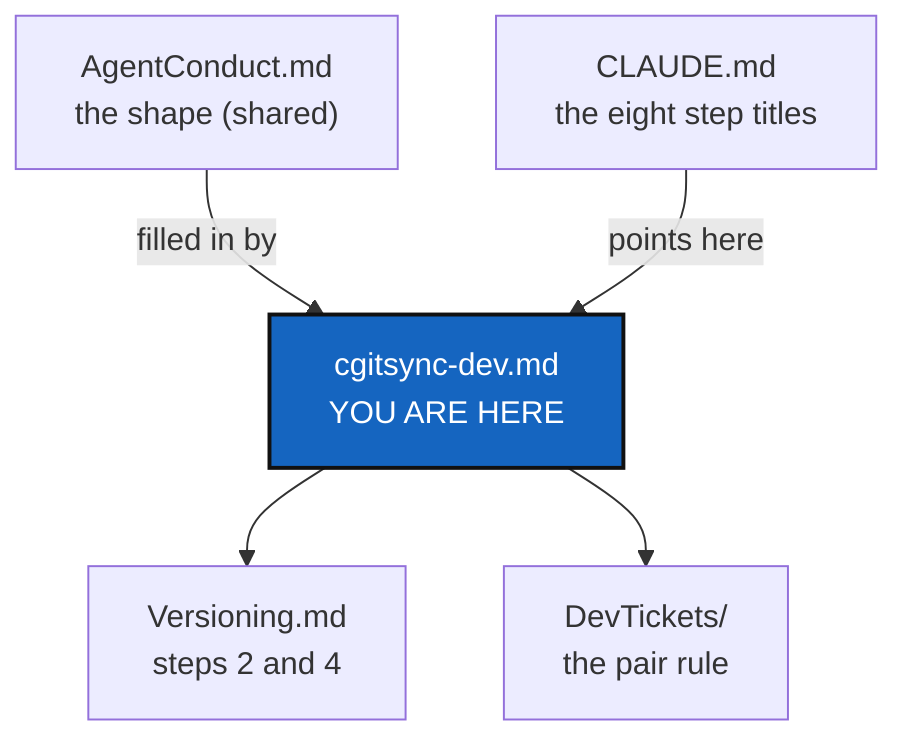

# cgitsync-dev — building, testing and finishing a change in ComplexGitSync

*Created: 2026-09-21*

*Fills in: ../../.distant/dev-sync/AgentConduct.md*

## Abstract — read this first

**What this document is.** This project's own fill-in for the
before-committing checklist, the pair rule and the testing section that
`DevSpecs.md` and `AgentConduct.md` state in general: which commands, which
repository, which paths, which choices. It restates none of their rules.

**Why it exists.** The shape of "finish a change" is the same for every
project, so it is written once in `AgentConduct.md`. The commands are
this project's. They used to be copied between `CLAUDE.md`, this file and
`AdditionalSpecs.md`, and the copies drifted. This is now the only place
that holds them; `CLAUDE.md` keeps the step titles.

**What you will find.** The Pixi commands, how to bootstrap a working
checkout, the eight checklist steps with this project's commands, the pair
rule's fill-in, the data contract and attribution fill-ins, and the testing
layout.

**Who it is for.** Anyone — human or agent — changing code or docs in this
repository. End users only need [README.md](../../../README.md).

**What you need to do with it.** Follow it before every commit. Read
`AgentConduct.md` first if you want the reason behind a step.



---

## Commands

This project uses Pixi, not bare `pip`/`venv`.

```bash
pixi install         # create/update the environment (run after touching pixi.toml or dependencies)
pixi run test        # pytest, tests/unit + tests/integration
pixi run lint        # ruff check .
pixi run bump-version  # orchestrator: bump SemVer and sync every manifest and doc
pixi run bump-build    # worker: bump __build__; then bump-version by the orchestrator (by the worker at patch only for a direct fix, no ticket)
pixi run check-spectree   # the spec tree: links, mounts, fills-in lines, digest
pixi run check-ceilings   # module ratchet, and every .agent/ path cited in code
```

CI (`.github/workflows/ci.yml`) runs both `lint` and `test` on push/PR to
`main`/`lechat`. Run both locally before pushing.

### Bootstrapping a working checkout

ComplexGitSync manages itself as a multi-repo tree: a fresh `git clone`
alone gets you the code but not `docs/` or any of the agentic mounts under
`.agent/`. Use `bootstrap` pointed at **`examples/complexgitsync4dev.cgs`**
— the developer spec — to get a fully populated, independently
live-editable checkout. (The root `install.cgs` is the *user* install: the
tool and its documentation only. Bootstrapping that one leaves you without
the specs you are reading. The two installs are `DevSpecs.md`'s *Two
installs*.)

```bash
git clone https://github.com/flipoyo/ComplexGitSync.git
cd ComplexGitSync
pixi install

pixi run cgitsync bootstrap examples/complexgitsync4dev.cgs
# Copy the export command from bootstrap's own output, or use:
export CGSHOME=/home/user/.cgs/ComplexGitSync-20260831131233

cd "$CGSHOME"       # this *is* the freshly cloned ComplexGitSync checkout —
pixi install        # bootstrap clones a plain checkout, so it needs its own
                    # pixi environment before you can run cgitsync from here
```

`$CGSHOME` now holds `ComplexGitSync` (mounted at its own root — the tree's
project entry), `docs/` (`DocComplexGitSync`), and every agentic mount under
`.agent/.distant/` (`ticket`, `dev-sync`, `documentation` — shared,
read-only) and `.agent/.local/` (`.localSpec`, `.claude` and `.dev` — ours to
write) cloned side by side. `pixi.toml`'s
`complexgitsync = { path = ".", editable = true }` makes this checkout
self-editable the moment that second `pixi install` finishes: edit any file
under `src/ComplexGitSync/`, then `pixi run cgitsync ...` from inside
`$CGSHOME` picks up the change immediately — no reinstall step, no separate
`pip install -e .`.

## Before committing — this project's own fill-ins

Do all of these as part of the change, not as a follow-up. The shape is
[AgentConduct.md](../../.distant/dev-sync/AgentConduct.md) §1.

1. **`pixi run lint` and `pixi run test` must both pass.** The full suite
   must pass before any merge to main, and before any task is considered
   closed (`DevSpecs.md`, *Testing*).
2. **Run `pixi run bump-build` for any change under `src/`.** It bumps only
   `__init__.py`'s `__build__` counter, independently of the SemVer in
   step 4, and a change that touches `src/` and skips it costs conformity
   score when the work is quoted. It is never the last versioning step: see
   step 4 and [Versioning.md](Versioning.md), *Who bumps what*.
3. **`cgitsync status`, run from this tree's own root, must show
   `errors=0`.** A green test suite proves the code works in isolation; it
   does not prove `cgitsync` can still describe the tree it is actually
   dogfooding itself against (`DevSpecs.md`, *Testing*). A row reading
   `error`/`error` — a repository whose branch has no commit for `git
   rev-parse HEAD` to resolve, most often — means a change left a real,
   tracked repository in a state the tool cannot read, which no unit test
   over a fixture would have caught. Fix the repository, or the code that
   left it that way, before calling a task finished; do not just note the
   error and move on.
4. **Run `pixi run bump-version {major,minor,patch}` after every
   `bump-build`, at `patch` at least**, and for any change outside `src/`
   that still changes what a command or script does (`scripts/`, a pixi
   task). The rule, who decides the level and the three cases agents got
   wrong are the shared [Versioning.md](../../.distant/dev-sync/Versioning.md);
   which files the command writes, `--pre`/`--release` and `--dry-run` are
   [Versioning.md](Versioning.md). Never hand-edit a version field.
5. **Rebuild the docs PDFs after every `bump-version`, and after any change
   to the docs.** `bump-version` rewrites `.tex` sources but does *not*
   regenerate the tracked PDFs, and every title page shows the version, so
   all of them are stale after a bump. The command and the reason are in
   [Versioning.md](Versioning.md), `bump-version`.
6. **Update `.agent/.local/.localSpec/AdditionalSpecs.md`'s architecture
   section** if module responsibility moved: its responsibility table and
   dependency-path diagram, before committing, as part of that task's
   change, not as a separate follow-up.
7. **Document any new CLI command** in `docs/Text/user_guide.tex`, and its
   client method in `docs/Text/api_python.tex`. The user-guide half is
   enforced by
   `tests/unit/test_cli_smoke.py::test_user_guide_documents_every_cli_command`.
   **Never add it to `README.md`** (owner, README-UX, 2026-10-06): the
   README is the user's front page — what the tool is for, how to install
   it, that `cgitsync --help` and `cgitsync <command> --help` list the
   commands and their options, and each use case in a sentence with its
   tutorial. No command table, no option list, no internals;
   `test_readme_stays_a_short_front_page` holds it under 250 lines. A new
   *use case* gets one row there and a tutorial; a new command does not.
8. **Deliver the commit message.** Finishing a ticket includes writing the
   commit message for the repositories the change touched — the project's
   own and each mounted configuration repository that changed. Deliver it
   as text in the finishing report; whether to commit is the owner's call
   unless the owner asks for it. `cgitsync commit` checks the message itself
   in a tree that has adopted DevSpec (`commit_message.py`) and refuses one
   that breaks the rule, naming which.

   This project's own fill-ins of
   [AgentConduct.md](../../.distant/dev-sync/AgentConduct.md) §1/§2: the
   project name is `cgitsync`, so a message reads `cgitsync-6.0.0` (owner,
   2026-10-09, ReleaseCommand D10; the checker also accepts
   `ComplexGitSync-6.0.0`). Run `pixi run bump-version`, step 4, first: the
   version is read from `pixi.toml`, so it must be current. Write the same
   message for `commit` and `commit --private`.
   `--commit-gitignore` and other messages ComplexGitSync generates for
   itself are not governed by this rule. On why "never push without being
   asked" cannot be delegated to GitHub's own branch protection here
   specifically: `main`'s `maintainerClearance` ruleset bypasses Admin,
   always, and the account these commands run as has that role — the
   convention in AgentConduct.md is the only barrier that actually holds.

## The pair rule — this project's fill-in

The rule in full is
[AgentConduct.md](../../.distant/dev-sync/AgentConduct.md) §4.
Implementing a ticket from [DevTickets/openTickets/](DevTickets/openTickets/)
takes a worker agent that makes the change and an independent orchestrator
agent that quotes it against this checklist, writes the record
(`cgitsync self-history add`; its score is out of 100, 33 + 33 + 34, always
shown with its maxima and explained with `--conformity-explanation`, per
`AdditionalSpecs.md`, *The conformity score*), and runs step 4
(`pixi run bump-version`) — the same judgement call as the record itself,
made by the same role for the reason AgentConduct.md §4 gives. Drafting,
ranking, or closing a ticket in `DevTickets/` is orchestration work already
and does not need a second orchestrator to quote it.

**The orders are in [CLAUDE.md](../.claude/CLAUDE.md)**, *When the owner
says `implement <ticket>`*: this project's statement of
[AgentConduct.md](../../.distant/dev-sync/AgentConduct.md) §4.1, naming the
Agent tool and `AskUserQuestion`. It is not restated here.
**The gate** is this project's fill-in of AgentConduct.md §4.2: a
planning ticket archived on or after 2026-10-09 with no orchestrator's
record fails `pixi run check-tickets`, and `cgitsync commit` refuses to
add it (`ticket_gate.py`).

## Whose data this is, and attribution — this project's fill-ins

[AgentDataContract.md](../../.distant/dev-sync/AgentDataContract.md) states
the owner's intent and what such a document can and cannot deliver, and
[legalTerms/anthropic.md](../../.distant/dev-sync/legalTerms/anthropic.md)
checks the provider's terms rather than assumes them: **partial** — they
permit the intent only with training opt-out enabled and outside the
Feedback/safety-review carve-outs, for the consumer-subscription access
path this project runs under today. The signed record lives at
`.agent/.distant/dev-sync/agent-contracts/`
(`ComplexGitSync.memory.agent_contract`), one per provider, with a
`current` pointer naming the one in force. `freeze_release()` and
`cgitsync self-history add` both read it and record its hash, absent rather
than fatal when nothing is signed.

[AgentConduct.md](../../.distant/dev-sync/AgentConduct.md) §3 states the two
attribution rules. This project's fill-ins:

- **Publication rule.** The agent is named in
  [README.md](../../../README.md)'s *LLM assistance* section, and in no
  other public place. Keep that section current.
- **Parametric names in the public front only** (owner, 2026-10-02). In the
  project's own repositories (those `status` shows with scope `project`:
  `ComplexGitSync` and `DocComplexGitSync`), any example that needs an
  agent's vendor or model (help text, `docs/`, tests, fixtures) writes the
  placeholders `vendor-name` and `model-name`, never a real one. In a
  repository `status` shows as `private/local` or `private/distant`
  (`.localSpec`, `.claude`, `.dev`, `.memory`, `.self-history`, the agent
  contracts under `.agent/.distant/dev-sync/`), specs, tickets and records
  name the real vendor and model, and must not be rewritten with
  placeholders.
- **Accounting rule.** What each agent actually did belongs in
  `.cgitsync/.memory/.self-history`: which ticket was served, which agent
  and role acted, its vendor and model version, the States the work moved
  between, and how far the specs were followed. `.memory` is
  `private = true`, pushed only to a private repository, and privacy
  propagates to everything nested inside it. **A self-history record must
  never reach a public repository**, and nothing in it may be copied into
  one. `cgitsync self-history add` writes one; `cgitsync self-history list`
  reads them back.

## Testing — this project's own layout

[DevSpecs.md](../../.distant/dev-sync/DevSpecs.md) *Testing* is the rule.

- Unit tests: `tests/unit/`; integration tests: `tests/integration/`.
- The integration suite includes: CGSi topology expansion checks, local
  file-remote `clone_cgs` / tag-checkout lifecycle restoration, and a
  CLI-first READY `.gts` git command cycle
  (`add → commit → push → release freeze → release load`) mirrored in the
  Python API.
- Install dev extras: `pixi install`. Run the suite: `pixi run test` from
  the repository root.
- Tests must not depend on network access or live git remotes.
- **A test that asserts on a date injects the date.** Every dated fact a
  command writes goes through `ClockProtocol` (`memory/ledger_entry.py`) —
  real by default (`orchestre.SystemClock`), fake by injection — so a test
  asserting on one supplies a fixed clock rather than reaching for
  `monkeypatch` on the real one. A test that patches only part of a scenario
  and lets the rest read the real calendar is green only until the two
  happen to agree, which is not really green at all (the ClockSeam ticket,
  archived).
